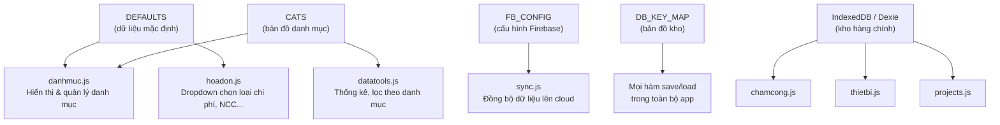
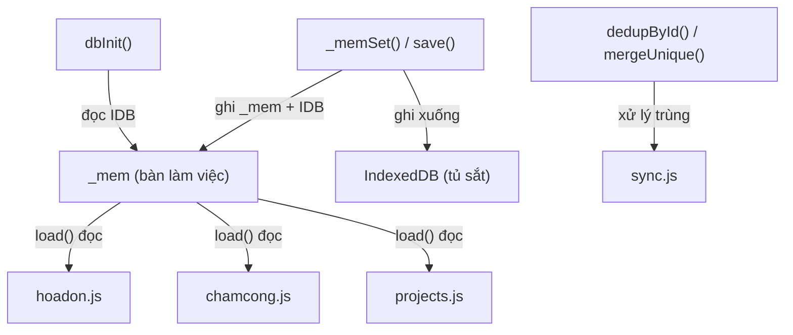
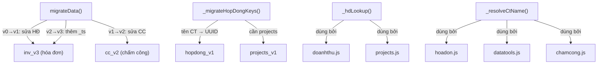
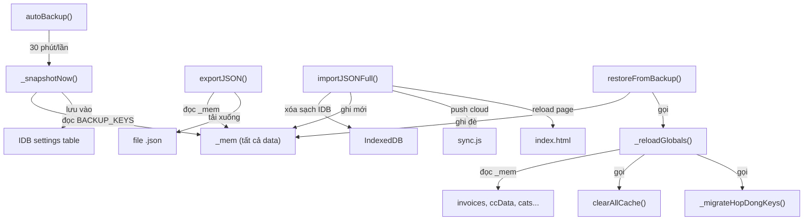
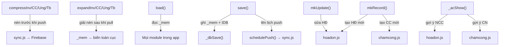
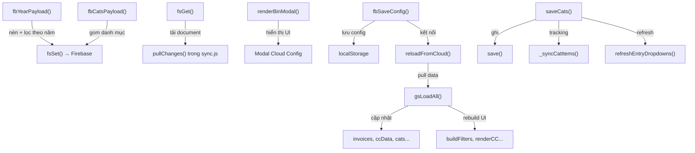
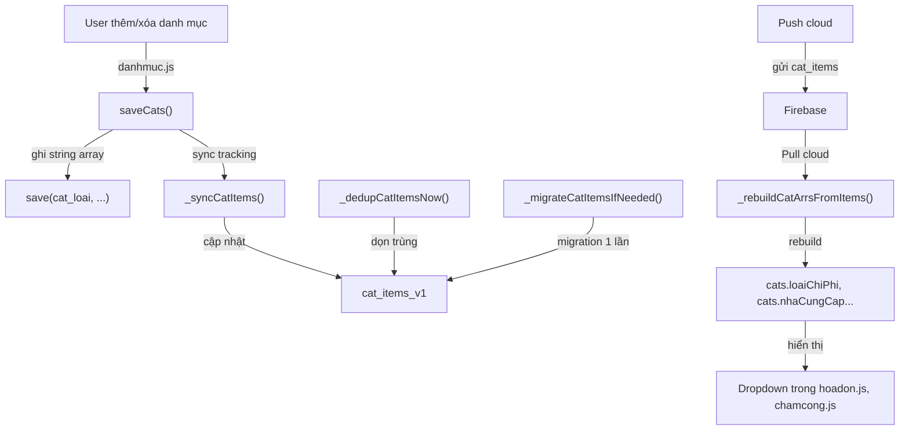
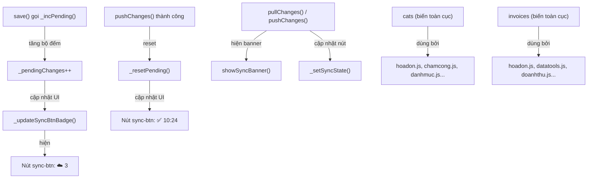
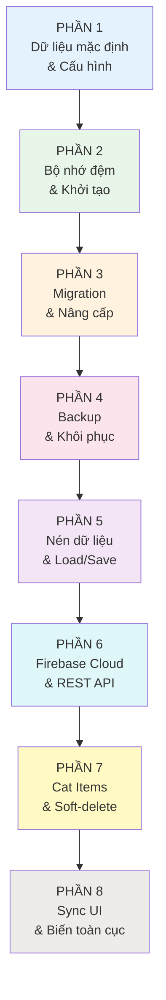

# 📖 GIẢI THÍCH FILE CORE.JS — APP QUẢN LÝ CHI PHÍ CÔNG TRÌNH

> [!IMPORTANT]
> File `core.js` là **file nền tảng** của toàn bộ ứng dụng. Nó được load **đầu tiên** (trước tất cả file khác). Mọi file khác như `hoadon.js`, `chamcong.js`, `doanhthu.js`... đều **phụ thuộc** vào file này.

---

## PHẦN 1: DỮ LIỆU MẶC ĐỊNH, CẤU HÌNH & "KHO CHỨA" CƠ SỞ DỮ LIỆU

📍 **Vị trí trong file**: [Dòng 1 → 102](file:///d:/NGUYEN%20HUU/APP%20QUAN%20LY%20CONG%20TRINH/Antigravity/core.js#L1-L102)

---

### 🎯 Mục đích

Phần này làm **3 việc quan trọng** khi app vừa bật lên:

1. **Khai báo dữ liệu mặc định** — tức là "nếu chưa có gì thì dùng cái này"
2. **Thiết lập kết nối Firebase** — cách app nói chuyện với "đám mây" để lưu dữ liệu online
3. **Tạo cơ sở dữ liệu trên máy** — nơi lưu tất cả hóa đơn, chấm công, thiết bị... ngay trên điện thoại/máy tính của bạn

Hãy tưởng tượng: Trước khi một cửa hàng mở cửa, bạn cần **sắp xếp kệ hàng** (tạo database), **dán nhãn từng kệ** (định nghĩa danh mục), và **chuẩn bị bảng giá mẫu** (dữ liệu mặc định). Phần 1 chính là bước chuẩn bị đó.

---

### 📚 Giải thích dễ hiểu

#### 1️⃣ Dữ liệu mặc định — DEFAULTS (dòng 8–16)

Khi bạn mới cài app lần đầu, app cần biết **một số thông tin sẵn** để bạn không phải nhập từ đầu. Đây là "bộ dữ liệu mẫu":

| Tên | Ý nghĩa | Ví dụ trong app |
|-----|---------|-----------------|
| `congTrinh` | Danh sách công trình mẫu | "CT BỬU AN - 85/5 LÊ LAI", "CT A DŨNG - SUỐI CÁT" |
| `loaiChiPhi` | Các loại chi phí | "Nhân Công", "Vật Liệu XD", "Sắt Thép", "Đổ Bê Tông"... |
| `nhaCungCap` | Nhà cung cấp mẫu | "Công ty VLXD Minh Phát", "Cửa Hàng Sắt Thép Hùng" |
| `nguoiTH` | Người thực hiện | "A Long", "A Toán", "A Dũng" |
| `tbTen` | Tên thiết bị/máy móc | "Máy cắt cầm tay", "Máy uốn sắt lớn", "Chân Dàn 1.7m" |

> **Nói đơn giản**: Giống như khi bạn mở một cuốn sổ mới — bên trong đã in sẵn mấy dòng ví dụ để bạn biết cách điền. Bạn có thể sửa, xóa, thêm tùy ý sau này.

#### 2️⃣ Bảng danh mục — CATS (dòng 18–26)

Đây là **bản đồ** nối giữa danh mục và nơi lưu trữ:

```
congTrinh  → lưu ở kho 'cat_ct'   → liên kết đến field 'congtrinh' trong hóa đơn
loaiChiPhi → lưu ở kho 'cat_loai' → liên kết đến field 'loai' trong hóa đơn
nhaCungCap → lưu ở kho 'cat_ncc'  → liên kết đến field 'ncc' trong hóa đơn
nguoiTH    → lưu ở kho 'cat_nguoi'→ liên kết đến field 'nguoi' trong hóa đơn
thauPhu    → lưu ở kho 'cat_tp'   → liên kết đến field 'tp' 
congNhan   → lưu ở kho 'cat_cn'   → không liên kết field (dùng riêng cho chấm công)
tbTen      → lưu ở kho 'cat_tbteb'→ không liên kết field (dùng riêng cho thiết bị)
```

> **Nói đơn giản**: Giống như một bảng chỉ mục ở đầu cuốn sổ — cho bạn biết danh mục "Công Trình" nằm ở trang nào, danh mục "Nhà Cung Cấp" nằm ở trang nào.

#### 3️⃣ Cấu hình Firebase & localStorage (dòng 28–57)

**Firebase** là dịch vụ "đám mây" của Google — nơi lưu dữ liệu online để:
- Bạn dùng trên nhiều thiết bị (điện thoại + máy tính) mà dữ liệu giống nhau
- Không sợ mất dữ liệu nếu điện thoại hư

App cần 2 thông tin để kết nối Firebase:
- **API Key**: như "chìa khóa" để vào kho
- **Project ID**: như "tên kho" bạn muốn vào

**localStorage** là nơi lưu cấu hình nhỏ ngay trên trình duyệt:
- `_loadLS(key)` = **lấy** dữ liệu ra
- `_saveLS(key, value)` = **ghi** dữ liệu vào

> **Nói đơn giản**: Firebase giống như một cái két sắt ở ngân hàng. `apiKey` là mã pin, `projectId` là số tài khoản. Còn localStorage giống như cái hộp nhỏ trong túi bạn — lưu mấy thứ hay dùng, truy cập nhanh.

#### 4️⃣ Cơ sở dữ liệu trên máy — IndexedDB / Dexie (dòng 59–102)

Đây là **"kho hàng chính"** của app trên thiết bị của bạn. Dùng thư viện **Dexie** để quản lý IndexedDB (cơ sở dữ liệu có sẵn trong trình duyệt).

Kho hàng có **6 kệ (bảng)**:

| Kệ (Table) | Chứa gì | Ví dụ |
|-------------|---------|-------|
| `invoices` | Hóa đơn, chi phí | "Mua xi măng 5 triệu ngày 15/04" |
| `attendance` | Chấm công | "Tuần 14–20/04: A Long làm 6 ngày" |
| `equipment` | Thiết bị | "Máy cắt cầm tay — ở CT Bửu An" |
| `ung` | Tiền ứng | "Ứng thầu phụ 20 triệu" |
| `revenue` | Thu tiền | "Thu đợt 1: 100 triệu" |
| `categories` | Danh mục | Tên công trình, loại chi phí... |
| `settings` | Cài đặt | Hợp đồng, dự án, thùng rác... |

Rồi **DB_KEY_MAP** (dòng 78–102) là bản đồ chi tiết hơn — nó nói cho app biết:
- Key `'inv_v3'` → lưu vào kệ `invoices`, dữ liệu là **danh sách** (mảng)
- Key `'cat_ct'` → lưu vào kệ `categories`, dữ liệu là **một dòng** có ID = `'congTrinh'`
- Key `'hopdong_v1'` → lưu vào kệ `settings`, dữ liệu là **một dòng** có ID = `'hopdong'`

> **Nói đơn giản**: Giống như một nhà kho lớn có 7 kệ. Mỗi kệ chứa một loại hàng. `DB_KEY_MAP` chính là tấm biển chỉ dẫn "thùng hóa đơn để kệ số 1, thùng chấm công để kệ số 2...".

---

### 💻 Code chính

```js
// Dữ liệu mặc định — dùng khi app mới cài, chưa có gì
const DEFAULTS = {
  congTrinh: ["CÔNG TY - NHÀ", "CT BỬU AN - 85/5 LÊ LAI...", ...],
  loaiChiPhi: ["Nhân Công", "Vật Liệu XD", "Sắt Thép", ...],
  nhaCungCap: ["Công ty VLXD Minh Phát", ...],
  nguoiTH: ["A Long", "A Toán", ...],
  tbTen: ['Máy cắt cầm tay', 'Máy uốn sắt lớn', ...]
};

// Bản đồ danh mục — nối tên danh mục với nơi lưu & field trong hóa đơn
const CATS = [
  { id:'congTrinh', title:'🏗️ Công Trình', sk:'cat_ct', refField:'congtrinh' },
  { id:'loaiChiPhi', title:'📂 Loại Chi Phí', sk:'cat_loai', refField:'loai' },
  // ...
];

// Cấu hình Firebase — chìa khóa kết nối đám mây
const FB_CONFIG = {
  apiKey:    '',   // Chìa khóa
  projectId: '',   // Tên kho
};

// Tạo cơ sở dữ liệu trên máy — 6 kệ hàng
const db = new Dexie('qlct');
db.version(1).stores({
  invoices:   'id, updatedAt',   // kệ hóa đơn
  attendance: 'id, updatedAt',   // kệ chấm công
  equipment:  'id, updatedAt',   // kệ thiết bị
  ung:        'id, updatedAt',   // kệ tiền ứng
  revenue:    'id, updatedAt',   // kệ thu tiền
  categories: 'id'               // kệ danh mục
});

// Bản đồ chi tiết: key nào → lưu vào kệ nào
const DB_KEY_MAP = {
  'inv_v3':      { table: 'invoices',   isArr: true  },
  'cc_v2':       { table: 'attendance', isArr: true  },
  'cat_ct':      { table: 'categories', isArr: false, rowId: 'congTrinh' },
  'hopdong_v1':  { table: 'settings',   isArr: false, rowId: 'hopdong' },
  // ...
};
```

---

### 🔍 Diễn giải code

| Dòng | Code | Ý nghĩa |
|------|------|---------|
| 8 | `const DEFAULTS = { ... }` | Khai báo "hộp dữ liệu mẫu" — dùng 1 lần khi cài app mới |
| 18 | `const CATS = [ ... ]` | Bản đồ danh mục: mỗi danh mục có ID, tiêu đề, key lưu trữ, field liên kết |
| 37–40 | `const FB_CONFIG = { ... }` | Khai báo ô trống cho API Key & Project ID Firebase |
| 49–52 | `(function() { ... })()` | Chạy ngay khi file load: đọc config Firebase đã lưu trước đó từ localStorage |
| 54–57 | `_loadLS()` / `_saveLS()` | 2 hàm tiện ích: đọc & ghi dữ liệu nhỏ vào localStorage |
| 63–74 | `const db = new Dexie('qlct')` | Tạo cơ sở dữ liệu tên `qlct` (Quản Lý Công Trình) với 7 bảng |
| 78–102 | `const DB_KEY_MAP = { ... }` | Bản đồ chi tiết: `'inv_v3'` → kệ `invoices` (dạng danh sách), `'cat_ct'` → kệ `categories` (dạng 1 dòng) |

---

### ✅ Kết luận

Hiểu phần này sẽ giúp bạn hiểu:

- **App lưu dữ liệu ở đâu**: chủ yếu trong IndexedDB (trên máy), sync lên Firebase (trên mây)
- **Cấu trúc dữ liệu**: app có 7 "kệ hàng" chính — mỗi kệ chứa một loại dữ liệu
- **Vì sao có `DEFAULTS`**: để lần đầu mở app, dropdown "Công trình", "Loại chi phí"... đã có sẵn mấy lựa chọn
- **Vì sao có `CATS`**: để app biết danh mục nào lưu ở đâu, và khi ghi hóa đơn thì field nào tương ứng với danh mục nào

---

### 🔗 Liên kết module



| Dữ liệu | Lấy từ đâu | Đi tới đâu | Ảnh hưởng file |
|----------|------------|------------|----------------|
| `DEFAULTS` | Khai báo cứng trong core.js | Dùng làm giá trị mặc định khi load danh mục | `danhmuc.js`, `hoadon.js`, mọi file dùng dropdown |
| `CATS` | Khai báo cứng trong core.js | Quản lý danh mục, save/load | `danhmuc.js`, `settings UI` |
| `FB_CONFIG` | localStorage (`fb_config`) | Kết nối Firebase REST API | `sync.js`, modal cấu hình cloud |
| `DB_KEY_MAP` | Khai báo cứng trong core.js | Hàm `_dbSave()`, `dbInit()`, `save()`, `load()` | **Tất cả file** — vì mọi module đều gọi `save()` / `load()` |
| IndexedDB tables | Trình duyệt tự tạo | Lưu toàn bộ dữ liệu nghiệp vụ | **Tất cả file** |

---

> [!NOTE]
> Đây là PHẦN 1/8. Phần tiếp theo giải thích **Bộ nhớ đệm & Quản lý dữ liệu trong RAM**.

---
---

## PHẦN 2: BỘ NHỚ ĐỆM (RAM) & KHỞI TẠO DỮ LIỆU

📍 **Vị trí trong file**: [Dòng 104 → 180](file:///d:/NGUYEN%20HUU/APP%20QUAN%20LY%20CONG%20TRINH/Antigravity/core.js#L104-L180)

---

### 🎯 Mục đích

Phần này giải quyết **một vấn đề thực tế**: Đọc dữ liệu từ IndexedDB (kho hàng) **rất chậm** — mỗi lần cần xem hóa đơn, app phải "đi vào kho lấy" mất vài chục mili giây. Nếu mỗi thao tác đều phải vào kho, app sẽ **giật lag**.

**Giải pháp**: Khi app khởi động, **chuyển TOÀN BỘ dữ liệu từ kho (IDB) ra bàn làm việc (RAM)**. Sau đó, mọi thao tác đọc đều lấy từ bàn làm việc — nhanh gấp hàng trăm lần.

Ngoài ra, phần này còn có **2 công cụ quan trọng** giúp xử lý dữ liệu bị trùng lặp — chuyện hay xảy ra khi dùng nhiều thiết bị cùng lúc.

---

### 📚 Giải thích dễ hiểu

#### 1️⃣ Bộ nhớ đệm `_mem` — "Bàn làm việc" (dòng 104–111)

`_mem` là một **đối tượng rỗng** `{}` — ban đầu không có gì. Khi app khởi động, hàm `dbInit()` sẽ **bê tất cả dữ liệu từ kho (IDB) ra bàn (`_mem`)**.

Sau đó:
- **Đọc dữ liệu** → lấy từ `_mem` (cực nhanh, không cần vào kho)
- **Ghi dữ liệu** → ghi vào `_mem` **VÀ** ghi xuống IDB (để không mất khi tắt app)

> **Ví dụ thực tế**: Bạn là kế toán. Sáng đến công ty, bạn **lấy cả chồng hồ sơ từ tủ sắt ra bàn**. Suốt ngày, bạn đọc/ghi trên bàn. Cuối ngày (hoặc sau mỗi lần sửa), bạn cất lại vào tủ. `_mem` chính là cái bàn, IndexedDB chính là tủ sắt.

Hàm `_memSet(k, v)` = **ghi vào cả bàn lẫn tủ**:
- Cập nhật `_mem[k] = v` (ghi lên bàn)
- Gọi `_dbSave(k, v)` (cất vào tủ)

#### 2️⃣ Xử lý trùng lặp — `dedupById` & `mergeUnique` (dòng 113–138)

**Vì sao lại bị trùng?** Khi bạn dùng app trên 2 thiết bị (ví dụ: điện thoại + máy tính) và cả hai đều thêm/sửa dữ liệu rồi đồng bộ lên cloud → có thể xuất hiện **2 bản ghi giống nhau** (cùng ID).

2 hàm này giải quyết vấn đề đó:

| Hàm | Khi nào dùng | Cách hoạt động |
|-----|-------------|----------------|
| `dedupById(arr)` | Sau import, sau sync | Nếu có 2 bản ghi cùng ID → **giữ bản mới nhất** (theo `updatedAt`) |
| `mergeUnique(old, new)` | Khi gộp dữ liệu cũ + mới | Gộp 2 danh sách thành 1, nếu trùng ID → **giữ bản mới hơn** |

> **Ví dụ thực tế**: Bạn ghi hóa đơn "Mua xi măng 5 triệu" trên điện thoại. Rồi trên máy tính, bạn sửa thành "Mua xi măng 5.5 triệu". Khi đồng bộ, app thấy 2 bản ghi cùng ID → giữ bản "5.5 triệu" (vì sửa sau = mới hơn).

#### 3️⃣ Ghi dữ liệu xuống kho — `_dbSave` (dòng 140–162)

Hàm này nhận một key (ví dụ `'inv_v3'`) và giá trị, rồi ghi vào đúng kệ trong IndexedDB.

Nó thông minh ở chỗ:
- Nếu dữ liệu là **danh sách** (hóa đơn, chấm công...): tự gán `id` và `updatedAt` nếu chưa có, **xóa bản ghi cũ không còn trong danh sách** (đây là cách xóa dữ liệu lan truyền xuống IDB)
- Nếu dữ liệu là **một đối tượng** (hợp đồng, cài đặt...): ghi đè trực tiếp

> **Ví dụ thực tế**: Bạn xóa 1 hóa đơn trên giao diện → danh sách `inv_v3` bây giờ thiếu 1 phần tử → `_dbSave` so sánh với IDB, thấy hóa đơn đó không còn → xóa luôn trong IDB.

#### 4️⃣ Khởi tạo dữ liệu — `dbInit` (dòng 164–180)

Đây là hàm **chạy đầu tiên** khi app mở lên. Nó làm đúng 1 việc:

**Đọc TẤT CẢ dữ liệu từ IndexedDB → đổ vào `_mem`**

```
dbInit chạy:
  📦 IDB kệ invoices   → 150 hóa đơn    → _mem['inv_v3'] = [150 hóa đơn]
  📦 IDB kệ attendance → 20 tuần CC      → _mem['cc_v2']  = [20 tuần]
  📦 IDB kệ equipment  → 30 thiết bị     → _mem['tb_v1']  = [30 thiết bị]
  📦 IDB kệ categories → danh mục CT     → _mem['cat_ct'] = ["CT Bửu An",...]
  ... (tất cả các key trong DB_KEY_MAP)
```

Sau khi `dbInit()` chạy xong → `_mem` chứa **toàn bộ dữ liệu** → app sẵn sàng hoạt động.

> **Nói đơn giản**: Giống như buổi sáng, bạn mở tủ sắt, bê HẾT hồ sơ ra bàn. Từ lúc đó trở đi, mỗi lần cần xem gì, bạn chỉ cần nhìn xuống bàn — không cần đi vào tủ nữa.

---

### 💻 Code chính

```js
// "Bàn làm việc" — ban đầu rỗng, dbInit() sẽ đổ dữ liệu vào
const _mem = {};

// Ghi vào bàn + cất vào tủ (IndexedDB)
function _memSet(k, v) {
  _mem[k] = v;
  _dbSave(k, v).catch(e => console.warn('[IDB] lỗi:', k, e));
}

// Loại bỏ bản ghi trùng ID — giữ bản mới nhất
function dedupById(arr) {
  const map = new Map();
  arr.forEach(r => {
    const existing = map.get(r.id);
    if (!existing || r.updatedAt >= existing.updatedAt)
      map.set(r.id, r);
  });
  return [...map.values()];
}

// Gộp 2 danh sách, xử lý trùng
function mergeUnique(oldArr, newArr) {
  const map = new Map();
  oldArr.forEach(r => map.set(r.id, r));
  newArr.forEach(r => {
    const existing = map.get(r.id);
    if (!existing || r.updatedAt > existing.updatedAt)
      map.set(r.id, r);
  });
  return [...map.values()];
}

// Ghi 1 key xuống IndexedDB
async function _dbSave(k, v) {
  const cfg = DB_KEY_MAP[k];
  if (!cfg) return;
  if (cfg.isArr) {
    // Danh sách: gán id/updatedAt, xóa bản không còn
    const records = v.map(r => {
      if (!r.id) r.id = crypto.randomUUID();
      if (!r.updatedAt) r.updatedAt = Date.now();
      return r;
    });
    // Xóa bản ghi cũ đã bị loại khỏi danh sách
    const existing = await db[cfg.table].toArray();
    const toDelete = existing.filter(r => !newIdSet.has(r.id));
    // ... rồi bulkPut vào IDB
  } else {
    // Đối tượng: ghi đè 1 dòng
    await db[cfg.table].put({ id: cfg.rowId, data: v });
  }
}

// KHỞI TẠO: đọc tất cả từ IDB → đổ vào _mem
async function dbInit() {
  for (const [key, cfg] of Object.entries(DB_KEY_MAP)) {
    if (cfg.isArr) {
      _mem[key] = await db[cfg.table].toArray();
    } else {
      const rec = await db[cfg.table].get(cfg.rowId);
      _mem[key] = rec ? rec.data : null;
    }
  }
  console.log('[IDB] dbInit hoàn tất');
}
```

---

### 🔍 Diễn giải code

| Dòng | Code | Ý nghĩa |
|------|------|---------|
| 105 | `const _mem = {}` | Tạo "bàn làm việc" rỗng — sẽ được đổ đầy dữ liệu khi khởi động |
| 108–111 | `function _memSet(k, v)` | Ghi vào RAM + IDB cùng lúc. Nếu IDB lỗi → chỉ log cảnh báo, không crash app |
| 115–125 | `function dedupById(arr)` | Dùng `Map` — mỗi ID chỉ giữ 1 bản. Nếu trùng → so `updatedAt`, giữ bản cao hơn |
| 128–138 | `function mergeUnique(old, new)` | Giống `dedupById` nhưng gộp **2 danh sách**. Ưu tiên bản mới hơn khi trùng ID |
| 143–162 | `async function _dbSave(k, v)` | Tra `DB_KEY_MAP` để biết ghi vào kệ nào. Nếu là danh sách → tự xóa bản ghi cũ đã bị loại |
| 166–180 | `async function dbInit()` | Vòng lặp qua mọi key trong `DB_KEY_MAP` → đọc từ IDB → gán vào `_mem` |

---

### ✅ Kết luận

Hiểu phần này sẽ giúp bạn hiểu:

- **`_mem` là nguồn sự thật duy nhất** — mọi hàm trong app đọc dữ liệu từ đây, KHÔNG đọc trực tiếp từ IDB
- **Vì sao app nhanh**: vì đọc từ RAM (tức thì), không phải đợi IDB
- **Vì sao dữ liệu không mất khi tắt app**: vì mỗi lần ghi → cập nhật cả `_mem` lẫn IDB
- **Vì sao không bị trùng dữ liệu** khi dùng nhiều thiết bị: nhờ `dedupById` và `mergeUnique`

---

### 🔗 Liên kết module



| Dữ liệu | Lấy từ đâu | Đi tới đâu | Ảnh hưởng file |
|----------|------------|------------|----------------|
| `_mem` | `dbInit()` đọc từ IDB lúc khởi động | Mọi hàm `load()` trong toàn app | **Tất cả file** |
| `_memSet()` | Gọi từ `_restoreStore()`, `_syncCatItems()`, migration | Ghi `_mem` + `_dbSave()` | core.js, sync.js |
| `dedupById()` | Gọi khi import JSON, khi sync | Trả về danh sách đã loại trùng | sync.js, `importJSONFull()` |
| `mergeUnique()` | Gọi khi pull từ cloud | Gộp data local + cloud | sync.js |
| `_dbSave()` | Gọi từ `save()`, `_memSet()` | Ghi xuống IndexedDB | core.js (nội bộ) |
| `dbInit()` | Gọi 1 lần khi app khởi động | Đổ toàn bộ IDB vào `_mem` | index.html → core.js |

---

> [!NOTE]
> Đây là PHẦN 2/8. Phần tiếp theo giải thích **Migration & Nâng cấp dữ liệu**.

---
---

## PHẦN 3: MIGRATION — TỰ ĐỘNG "SỬA CHỮA" DỮ LIỆU CŨ

📍 **Vị trí trong file**: [Dòng 182 → 361](file:///d:/NGUYEN%20HUU/APP%20QUAN%20LY%20CONG%20TRINH/Antigravity/core.js#L182-L361)

---

### 🎯 Mục đích

Phần này xử lý **một tình huống rất quan trọng**: Khi bạn cập nhật app lên phiên bản mới, cấu trúc dữ liệu có thể **thay đổi**. Ví dụ:
- Phiên bản cũ: hóa đơn **không có** trường "số lượng" (`sl`)
- Phiên bản mới: hóa đơn **bắt buộc** phải có trường `sl`

Nếu không xử lý, dữ liệu cũ sẽ bị lỗi khi chạy code mới. Migration tự động **vá** dữ liệu cũ cho khớp với phiên bản mới.

Ngoài ra, phần này còn xử lý việc **chuyển đổi key hợp đồng** từ "tên công trình" sang "mã dự án" (UUID) — một thay đổi lớn về cách tổ chức dữ liệu.

> **Ví dụ đời thật**: Giống như khi công ty đổi mẫu phiếu thu mới — bạn cần đi qua TẤT CẢ phiếu thu cũ, bổ sung thêm ô "số lượng" (ghi = 1 nếu thiếu), thêm ô "ngày tạo" (ghi = ngày hôm nay nếu thiếu). Migration chính là "nhân viên" tự động làm việc này.

---

### 📚 Giải thích dễ hiểu

#### 1️⃣ Hệ thống phiên bản dữ liệu — `DATA_VERSION` (dòng 187–191)

App có một con số gọi là `DATA_VERSION` (hiện tại = **4**). Mỗi khi cấu trúc dữ liệu thay đổi, số này tăng lên 1.

Khi app khởi động:
- App kiểm tra: "Dữ liệu của user đang ở version mấy?"
- Nếu version cũ < version hiện tại → **chạy migration**
- Nếu đã cập nhật rồi → **bỏ qua**

```
Thiết bị lưu: version = 2
App hiện tại:  version = 4
→ Cần chạy migration từ v2 → v3, rồi v3 → v4
```

#### 2️⃣ Các bước migration cụ thể — `migrateData()` (dòng 195–243)

| Từ → Đến | Sửa gì | Ví dụ thực tế |
|----------|--------|---------------|
| v0 → v1 | Hóa đơn thiếu `sl` (số lượng) → gán = 1. Thiếu `thanhtien` → tính = `tien × sl` | HĐ "Mua sắt 500k" → thêm sl=1, thanhtien=500k |
| v1 → v2 | Chấm công: worker thiếu `phucap` (phụ cấp) → gán = 0. Thiếu `hdmuale` → gán = 0 | CN "A Long" chưa có phụ cấp → thêm phucap=0 |
| v2 → v3 | Hóa đơn thiếu `_ts` (timestamp tạo) → gán = ID hoặc thời điểm hiện tại | Đảm bảo mọi HĐ đều biết "tạo lúc nào" |
| v3 → v4 | Chuyển key hợp đồng từ "tên CT" sang "mã UUID" | Xem mục 3 bên dưới |

> **Nói đơn giản**: Mỗi lần nâng cấp app, hệ thống tự "rà soát" toàn bộ sổ sách cũ, bổ sung các ô còn thiếu. User không cần làm gì cả.

#### 3️⃣ Chuyển đổi key hợp đồng — `_migrateHopDongKeys()` (dòng 257–299)

Đây là migration **phức tạp nhất**. Trước đây, hợp đồng được lưu theo **tên công trình**:

```
Trước (cũ):  hopDongData["CT BỬU AN - 85/5 LÊ LAI"] = { giaTriHD: 500000000 }
Sau (mới):   hopDongData["a1b2c3d4-..."] = { giaTriHD: 500000000, projectId: "a1b2c3d4-..." }
```

**Vì sao phải đổi?** Vì nếu user đổi tên công trình (sửa lỗi chính tả chẳng hạn), dữ liệu hợp đồng sẽ bị **mất liên kết**. Dùng UUID (mã duy nhất không đổi) thì dù đổi tên bao nhiêu lần, hợp đồng vẫn gắn đúng công trình.

Hàm này rất **an toàn**:
- Key đã là UUID → giữ nguyên, không làm gì
- Key là tên CT → tìm project tương ứng → đổi sang UUID
- Key không match → **giữ nguyên** (không xóa, tránh mất dữ liệu)
- Chạy nhiều lần cũng không sao (idempotent)

#### 4️⃣ Tra cứu hợp đồng — `_hdLookup()` & `_hdKeyOf()` (dòng 307–333)

Vì có thể tồn tại **cả key cũ (tên CT) lẫn key mới (UUID)** trong hệ thống, cần 2 hàm "thông minh" để tìm đúng hợp đồng:

**`_hdLookup(key)`** — Tìm hợp đồng theo bất kỳ cách nào:
1. Thử tìm trực tiếp theo key → nếu có, trả về
2. Nếu key là tên CT → tìm project → lấy UUID → tìm lại
3. Nếu key là UUID → tìm project → lấy tên → tìm lại

> **Ví dụ**: `_hdLookup("CT BỬU AN")` → không tìm thấy bằng tên → tìm project "CT BỬU AN" → lấy UUID `"a1b2c3"` → tìm `hopDongData["a1b2c3"]` → **tìm thấy!**

**`_hdKeyOf(project)`** — Trả về key chính xác trong hopDongData cho 1 project

#### 5️⃣ Helper tra cứu dự án — Global helpers (dòng 335–361)

4 hàm tiện ích giúp các module khác tra cứu thông tin dự án **an toàn** (không crash nếu `projects.js` chưa load):

| Hàm | Tác dụng | Ví dụ |
|-----|---------|-------|
| `_getProjectById(id)` | Tìm project theo UUID | `_getProjectById("a1b2...")` → `{name: "CT Bửu An", ...}` |
| `_getProjectNameById(id)` | Lấy tên project | `_getProjectNameById("a1b2...")` → `"CT Bửu An"` |
| `_getProjectIdByName(name)` | Tìm UUID theo tên | `_getProjectIdByName("CT Bửu An")` → `"a1b2..."` |
| `_resolveCtName(record)` | Lấy tên CT từ bất kỳ bản ghi nào | Thử `projectId` trước, fallback `ct` hoặc `congtrinh` |

> **Nói đơn giản**: Các hàm này giống như "nhân viên hỗ trợ" — bạn đưa mã công trình hoặc tên công trình, họ sẽ tìm giúp bạn thông tin đầy đủ.

---

### 💻 Code chính

```js
// Phiên bản dữ liệu hiện tại
const DATA_VERSION = 4;

function migrateData() {
  const stored = parseInt(_loadLS('app_data_version') || '0');
  if (stored >= DATA_VERSION) return; // Đã cập nhật, bỏ qua

  // v0 → v1: Hóa đơn thiếu số lượng → gán = 1
  if (stored < 1) {
    const invs = _loadLS('inv_v3') || [];
    invs.forEach(inv => {
      if (inv.sl === undefined) inv.sl = 1;
      if (inv.thanhtien === undefined) inv.thanhtien = inv.tien * inv.sl;
    });
    if (changed) _saveLS('inv_v3', invs);
  }

  // v1 → v2: Chấm công thiếu phụ cấp → gán = 0
  if (stored < 2) { /* ... tương tự ... */ }

  // v2 → v3: Hóa đơn thiếu timestamp → gán thời gian hiện tại
  if (stored < 3) { /* ... */ }

  // v3 → v4: Chuyển key hợp đồng (xử lý riêng trong _migrateHopDongKeys)

  _saveLS('app_data_version', DATA_VERSION); // Đánh dấu "đã nâng cấp xong"
}

// Chuyển key hợp đồng: tên CT → UUID
function _migrateHopDongKeys() {
  // Build lookup: tên CT → UUID
  const nameToId = new Map();
  projects.forEach(p => nameToId.set(p.name, p.id));

  for (const [key, hd] of Object.entries(hopDongData)) {
    // Key đã là UUID (36 ký tự) → giữ nguyên
    if (key.length === 36 && key.split('-').length === 5) continue;
    // Key là tên CT → đổi sang UUID
    const pid = nameToId.get(key);
    if (pid) migrated[pid] = { ...hd, projectId: pid };
  }
}

// Tra cứu hợp đồng — thử UUID trước, fallback tên CT
function _hdLookup(projectIdOrName) {
  const direct = hopDongData[projectIdOrName];
  if (direct) return direct;
  // Thử tìm theo tên → UUID → lookup lại
  const p = projects.find(proj => proj.name === projectIdOrName);
  if (p && hopDongData[p.id]) return hopDongData[p.id];
  return null;
}

// Lấy tên CT từ bất kỳ record nào
function _resolveCtName(record) {
  if (record.projectId) {
    const name = _getProjectNameById(record.projectId);
    if (name) return name;
  }
  return record.ct || record.congtrinh || '';
}
```

---

### 🔍 Diễn giải code

| Dòng | Code | Ý nghĩa |
|------|------|---------|
| 190 | `const DATA_VERSION = 4` | Phiên bản cấu trúc dữ liệu hiện tại. Tăng khi thay đổi schema |
| 196–197 | `if (stored >= DATA_VERSION) return` | Nếu đã cập nhật rồi → không làm gì (tiết kiệm thời gian) |
| 202–211 | `if (stored < 1)` | Migration v0→v1: quét tất cả hóa đơn, bổ sung `sl` và `thanhtien` |
| 214–225 | `if (stored < 2)` | Migration v1→v2: quét chấm công, bổ sung `phucap` và `hdmuale` |
| 241 | `_saveLS(DATA_VERSION_KEY, DATA_VERSION)` | Đánh dấu "đã nâng cấp xong" — lần sau không chạy lại |
| 264 | `nameToId.set(p.name, p.id)` | Xây bảng tra: tên CT → UUID, để đổi key hợp đồng |
| 272 | `key.length === 36 && key.split('-').length === 5` | Kiểm tra key đã là UUID chưa (UUID có 36 ký tự, 5 phần) |
| 310–320 | `_hdLookup()` | Chiến lược tìm 3 bước: trực tiếp → tên→UUID → UUID→tên |
| 354–361 | `_resolveCtName(record)` | Ưu tiên `projectId`, fallback `ct`/`congtrinh` — luôn trả về tên hiển thị |

---

### ✅ Kết luận

Hiểu phần này sẽ giúp bạn hiểu:

- **Vì sao app không bao giờ bị lỗi khi cập nhật**: migration tự vá dữ liệu cũ
- **Vì sao hợp đồng dùng UUID thay vì tên**: để đổi tên CT không làm mất liên kết
- **Cách app tìm hợp đồng**: thử 3 cách khác nhau, luôn tìm được nếu dữ liệu tồn tại
- **Vì sao có `_resolveCtName`**: vì dữ liệu cũ dùng `congtrinh` (tên), dữ liệu mới dùng `projectId` (UUID) — hàm này xử lý cả hai

---

### 🔗 Liên kết module



| Dữ liệu / Hàm | Lấy từ đâu | Đi tới đâu | Ảnh hưởng file |
|----------------|------------|------------|----------------|
| `migrateData()` | Gọi khi khởi động app + sau restore backup | Sửa `inv_v3`, `cc_v2` trong localStorage | core.js (nội bộ) |
| `_migrateHopDongKeys()` | Gọi trong `_reloadGlobals()` | Sửa `hopdong_v1` → ghi `_mem` + IDB | core.js, doanhthu.js |
| `_hdLookup()` | Gọi từ mọi nơi cần đọc hợp đồng | Trả về object hợp đồng | doanhthu.js, projects.js, datatools.js |
| `_hdKeyOf()` | Gọi khi cần key chính xác để ghi | Trả về key (UUID hoặc tên) | doanhthu.js, projects.js |
| `_resolveCtName()` | Gọi khi hiển thị tên CT trên giao diện | Trả về tên CT dạng string | hoadon.js, chamcong.js, datatools.js, thietbi.js |
| `_getProjectById/Name/Id()` | Gọi từ mọi module cần thông tin project | Trả về project object hoặc tên/ID | **Tất cả file hiển thị tên CT** |

---

> [!NOTE]
> Đây là PHẦN 3/8. Phần tiếp theo giải thích **Backup & Khôi phục dữ liệu**.

---
---

## PHẦN 4: BACKUP & KHÔI PHỤC DỮ LIỆU

📍 **Vị trí trong file**: [Dòng 363 → 661](file:///d:/NGUYEN%20HUU/APP%20QUAN%20LY%20CONG%20TRINH/Antigravity/core.js#L363-L661)

---

### 🎯 Mục đích

Phần này đảm bảo **bạn không bao giờ mất dữ liệu**. Nó cung cấp 3 lớp bảo vệ:

1. **Backup tự động** — cứ 30 phút, app âm thầm chụp lại toàn bộ dữ liệu (giữ tối đa 5 bản)
2. **Xuất/Nhập JSON** — bạn có thể tải dữ liệu ra file, rồi nhập lại bất cứ lúc nào
3. **Khôi phục** — quay lại bất kỳ bản backup nào trong danh sách

Ngoài ra, phần này còn chứa **2 hàm trung tâm** mà toàn bộ app phụ thuộc vào: `_reloadGlobals()` (tải lại tất cả biến toàn cục) và `afterDataChange()` (cập nhật giao diện sau khi dữ liệu thay đổi).

> **Ví dụ đời thật**: Giống như bạn có 3 cách bảo vệ sổ sách: (1) Mỗi 30 phút tự photocopy 1 bản, (2) Cuối ngày bạn có thể scan ra file PDF gửi email, (3) Nếu sổ bị hư, bạn lấy bản photocopy ra dùng lại.

---

### 📚 Giải thích dễ hiểu

#### 1️⃣ Danh sách key cần backup — `BACKUP_KEYS` (dòng 371–392)

Đây là **danh sách tất cả "ngăn kéo"** cần chụp lại khi backup:

| Key | Chứa gì | Ghi chú |
|-----|---------|---------|
| `inv_v3` | Hóa đơn / chi phí | Sync cloud ✅ |
| `ung_v1` | Tiền ứng | Sync cloud ✅ |
| `cc_v2` | Chấm công | Sync cloud ✅ |
| `tb_v1` | Thiết bị | Sync cloud ✅ |
| `thu_v1` | Thu tiền | Sync cloud ✅ |
| `cat_ct`, `cat_loai`... | Các danh mục | Sync cloud ✅ |
| `hopdong_v1` | Hợp đồng | Chỉ local |
| `thauphu_v1` | HĐ thầu phụ | Chỉ local |
| `projects_v1` | Dự án | Sync cloud ✅ |

> **Nói đơn giản**: Khi muốn thêm loại dữ liệu mới vào backup, chỉ cần thêm 1 dòng vào danh sách này — không cần sửa bất kỳ code nào khác.

#### 2️⃣ Backup tự động — `autoBackup()` & `_snapshotNow()` (dòng 542–569)

Khi app khởi động:
1. **Đợi 1 phút** (để app load xong)
2. **Chụp 1 bản backup đầu tiên**
3. **Cứ 30 phút chụp 1 bản** — tự động, không cần thao tác

Mỗi bản backup chứa:
- Tên app (`cpct`)
- Phiên bản dữ liệu (`ver: 4`)
- Thời gian chụp (`_time: "2026-04-24T10:15:00"`)
- Nhãn (`_label: "auto"` hoặc `"manual"`)
- **Toàn bộ dữ liệu** (`store: { inv_v3: [...], cc_v2: [...], ... }`)

App giữ **tối đa 5 bản** — bản cũ nhất tự xóa khi có bản mới.

> **Nói đơn giản**: Giống camera giám sát quay liên tục — cứ 30 phút chụp 1 ảnh lưu lại, giữ 5 ảnh gần nhất.

#### 3️⃣ Khôi phục backup — `restoreFromBackup()` (dòng 580–601)

Khi bạn chọn khôi phục:
1. App **hỏi xác nhận**: "Bạn có chắc? Data hiện tại sẽ bị thay thế"
2. **Chụp backup hiện tại** trước (phòng trường hợp muốn quay lại)
3. **Ghi đè toàn bộ dữ liệu** bằng bản backup đã chọn
4. **Tải lại giao diện** — mọi tab, dropdown, bảng dữ liệu đều được cập nhật

#### 4️⃣ Xuất JSON — `exportJSON()` (dòng 645–661)

Chụp toàn bộ `_mem` (bàn làm việc) → đóng gói thành file JSON → tải xuống máy.

File tải về có tên dạng: `cpct_snapshot_2026-04-24_10-15.json`

> **Nói đơn giản**: Giống "scan toàn bộ sổ sách ra file PDF" — bạn có thể gửi cho người khác hoặc cất riêng.

#### 5️⃣ Nhập JSON — `importJSON()` & `importJSONFull()` (dòng 664–792)

Đây là thao tác **mạnh nhất và nguy hiểm nhất** — nó **xóa sạch** tất cả dữ liệu hiện có rồi ghi đè bằng file JSON:

```
Bước 1: Đọc file JSON → kiểm tra hợp lệ
Bước 2: Hiện modal cảnh báo → yêu cầu xác nhận
Bước 3: Xóa sạch IDB + _mem
Bước 4: Gán id/updatedAt + loại trùng (dedupById)
Bước 5: Ghi vào _mem + IDB
Bước 6: Chặn pull cloud 2 giờ (tránh cloud ghi đè lại data mới import)
Bước 7: Push lên cloud (ghi đè cloud bằng data mới)
Bước 8: Reload trang
```

> **Nói đơn giản**: Giống "đem toàn bộ sổ sách cũ bỏ đi, thay bằng bộ sổ mới hoàn toàn". App hỏi xác nhận vì thao tác này không thể hoàn tác.

#### 6️⃣ Tải lại toàn bộ biến — `_reloadGlobals()` (dòng 467–511)

Đây là **hàm quan trọng bậc nhất**. Sau mỗi lần dữ liệu thay đổi lớn (pull cloud, import, restore backup), hàm này **đọc lại TẤT CẢ** từ `_mem` vào các biến toàn cục:

```
_reloadGlobals() chạy:
  invoices    ← load('inv_v3')      → biến toàn cục cho hóa đơn
  ungRecords  ← load('ung_v1')      → biến toàn cục cho tiền ứng
  ccData      ← load('cc_v2')       → biến toàn cục cho chấm công
  tbData      ← load('tb_v1')       → biến toàn cục cho thiết bị
  cats.*      ← load('cat_*')       → tất cả danh mục
  hopDongData ← load('hopdong_v1')  → hợp đồng
  projects    ← load('projects_v1') → dự án
  ... rồi chạy migration, rebuild, clear cache
```

#### 7️⃣ Hàm "sau khi data thay đổi" — `afterDataChange()` (dòng 460–464)

Gọi hàm này = **3 bước tự động**:
1. `_reloadGlobals()` → đọc lại tất cả biến
2. `clearAllCache()` → xóa cache cũ
3. `renderActiveTab()` → vẽ lại giao diện tab đang mở

---

### 💻 Code chính

```js
// Danh sách tất cả key cần backup
const BACKUP_KEYS = [
  'inv_v3', 'ung_v1', 'cc_v2', 'tb_v1', 'thu_v1',
  'cat_ct', 'cat_loai', 'cat_ncc', 'cat_nguoi', 'cat_tp', 'cat_cn',
  'projects_v1', 'hopdong_v1', 'thauphu_v1', 'cat_tbteb',
  'cat_ct_years', 'cat_cn_roles', 'cat_items_v1',
];

// Chụp snapshot toàn bộ dữ liệu
async function _snapshotNow(label) {
  const store = {};
  for (const k of BACKUP_KEYS) {
    const v = load(k, null);
    if (v !== null) store[k] = v;
  }
  const snap = {
    app: 'cpct', ver: DATA_VERSION,
    _time: new Date().toISOString(),
    _label: label || 'auto',
    store,
  };
  const list = await _getBackupStore();
  list.unshift(snap);              // Thêm vào đầu danh sách
  await _setBackupStore(list.slice(0, 5)); // Giữ tối đa 5 bản
  return snap;
}

// Backup tự động: đợi 1 phút, rồi cứ 30 phút chụp 1 lần
function autoBackup() {
  setTimeout(() => {
    _snapshotNow('auto');
    setInterval(() => _snapshotNow('auto'), 30 * 60 * 1000);
  }, 60 * 1000);
}

// Khôi phục 1 bản backup
async function restoreFromBackup(index) {
  const list = await _getBackupStore();
  const b = list[index];
  // Hỏi xác nhận
  if (!confirm('⚠️ Data hiện tại sẽ bị thay thế. Tiếp tục?')) return;
  // Chụp backup hiện tại trước khi khôi phục
  await _snapshotNow('before-restore');
  // Ghi đè dữ liệu
  _restoreStore(b.store);
  // Tải lại toàn bộ
  _reloadGlobals();
  toast('✅ Đã khôi phục bản backup');
}

// Xuất toàn bộ ra file JSON
function exportJSON() {
  const snap = { meta: { version: DATA_VERSION }, data: { ..._mem } };
  const blob = new Blob([JSON.stringify(snap, null, 2)]);
  // Tạo link tải xuống
  const a = document.createElement('a');
  a.href = URL.createObjectURL(blob);
  a.download = 'cpct_snapshot_2026-04-24_10-15.json';
  a.click();
}

// Tải lại TẤT CẢ biến toàn cục
function _reloadGlobals() {
  invoices   = load('inv_v3', []);
  ungRecords = load('ung_v1', []);
  ccData     = load('cc_v2', []);
  tbData     = load('tb_v1', []);
  cats.congTrinh  = load('cat_ct', DEFAULTS.congTrinh);
  cats.loaiChiPhi = load('cat_loai', DEFAULTS.loaiChiPhi);
  // ... tất cả danh mục + hợp đồng + projects
  _migrateHopDongKeys();       // Migration hợp đồng
  _migrateCatItemsIfNeeded();  // Migration danh mục
  _rebuildCatArrsFromItems();  // Rebuild từ cat_items
  clearAllCache();             // Xóa cache
}

// Sau mọi thay đổi lớn: reload → clear cache → render
function afterDataChange() {
  _reloadGlobals();
  if (typeof renderActiveTab === 'function') renderActiveTab();
}
```

---

### 🔍 Diễn giải code

| Dòng | Code | Ý nghĩa |
|------|------|---------|
| 371–392 | `BACKUP_KEYS = [...]` | Danh sách đầy đủ các key cần backup — thêm key mới vào đây là đủ |
| 394–396 | `BACKUP_MINS = 30` | Backup tự động mỗi 30 phút |
| 514 | `_BACKUP_MAX = 5` | Giữ tối đa 5 bản — bản cũ tự bị thay thế |
| 542–558 | `_snapshotNow(label)` | Đọc tất cả key → đóng gói → thêm vào đầu danh sách → cắt giữ 5 bản |
| 560–569 | `autoBackup()` | Đợi 1 phút → chụp → cứ 30 phút chụp tiếp |
| 593 | `_snapshotNow('before-restore')` | **Chụp bảo hiểm** trước khi khôi phục — luôn có đường quay lại |
| 646–661 | `exportJSON()` | Đóng gói `_mem` → tạo Blob → tải xuống file `.json` |
| 737 | `Promise.all(db.tables.map(t => t.clear()))` | Import JSON: **xóa sạch** toàn bộ IDB trước khi ghi mới |
| 769 | `localStorage.setItem('_blockPullUntil', ...)` | Chặn cloud pull 2 giờ sau import — tránh cloud ghi đè data vừa nhập |
| 467–511 | `_reloadGlobals()` | Đọc lại TẤT CẢ biến từ `_mem` → chạy migration → rebuild → clear cache |
| 460–464 | `afterDataChange()` | Gọi `_reloadGlobals()` + `renderActiveTab()` — "combo" sau mỗi thay đổi lớn |

---

### ✅ Kết luận

Hiểu phần này sẽ giúp bạn hiểu:

- **App tự bảo vệ dữ liệu**: backup tự động mỗi 30 phút, giữ 5 bản gần nhất
- **Cách xuất/nhập dữ liệu**: export ra JSON để chia sẻ hoặc lưu trữ, import lại khi cần
- **Import JSON rất cẩn thận**: xóa sạch → ghi mới → chặn cloud → push → reload
- **`_reloadGlobals()` là trung tâm**: mọi thay đổi dữ liệu lớn đều phải gọi hàm này
- **`afterDataChange()` là "combo cuối"**: reload biến + xóa cache + vẽ lại giao diện

---

### 🔗 Liên kết module



| Dữ liệu / Hàm | Lấy từ đâu | Đi tới đâu | Ảnh hưởng file |
|----------------|------------|------------|----------------|
| `BACKUP_KEYS` | Khai báo trong core.js | `_snapshotNow()`, `exportJSON()` | core.js |
| `autoBackup()` | Gọi từ `index.html` khi app khởi động | Lưu backup vào IDB settings | core.js |
| `exportJSON()` | Gọi từ UI Settings | Tải file JSON xuống máy | core.js |
| `importJSONFull()` | Gọi từ UI khi user chọn file JSON | Xóa + ghi IDB, push cloud, reload | core.js, sync.js |
| `_reloadGlobals()` | Gọi sau pull, import, restore, startup | Cập nhật `invoices`, `ccData`, `cats`... | **Tất cả file** — vì cập nhật biến toàn cục |
| `afterDataChange()` | Gọi sau pull cloud, delete, restore | `_reloadGlobals()` + `renderActiveTab()` | **Tất cả file render** |

---

> [!NOTE]
> Đây là PHẦN 4/8. Phần tiếp theo giải thích **Nén/Giải nén dữ liệu & Hàm load/save**.

---
---

## PHẦN 5: NÉN DỮ LIỆU, LOAD/SAVE & CÔNG CỤ DÙNG CHUNG

📍 **Vị trí trong file**: [Dòng 797 → 994](file:///d:/NGUYEN%20HUU/APP%20QUAN%20LY%20CONG%20TRINH/Antigravity/core.js#L797-L994)

---

### 🎯 Mục đích

Phần này làm **4 việc**:

1. **Nén dữ liệu** trước khi gửi lên cloud — giảm dung lượng, tiết kiệm bandwidth
2. **Cung cấp 2 hàm cốt lõi** `load()` / `save()` — mọi module trong app đều dùng
3. **Chuẩn hóa cách tạo/sửa record** — đảm bảo mọi bản ghi đều có `id`, `updatedAt`, `deviceId`
4. **Autocomplete dùng chung** — dropdown gợi ý khi nhập liệu

> **Ví dụ đời thật**: Giống như khi bạn gửi bưu kiện — bạn **nén đồ lại** (gấp nhỏ quần áo) để tiết kiệm phí vận chuyển. Khi nhận hàng, bạn **mở ra** (trải quần áo). Nén/giải nén dữ liệu hoạt động y hệt.

---

### 📚 Giải thích dễ hiểu

#### 1️⃣ Nén/Giải nén dữ liệu — compress/expand (dòng 797–861)

Khi gửi dữ liệu lên Firebase, app **rút gọn tên field** để nhỏ hơn:

**Hóa đơn (Invoice):**
```
Trước nén (dễ đọc):           Sau nén (nhỏ gọn):
{                              {
  id: "abc-123",        →        i: "abc-123",
  ngay: "2026-04-24",   →        d: "2026-04-24",
  congtrinh: "CT X",    →        c: "CT X",
  loai: "Vật Liệu XD", →        l: "Vật Liệu XD",
  nguoi: "A Long",      →        n: "A Long",
  tien: 500000,         →        p: 500000,
  thanhtien: 500000,    →        (bỏ qua nếu = tien)
  sl: 1,                →        (bỏ qua nếu = 1)
}                              }
```

App có **4 cặp** nén/giải nén cho 4 loại dữ liệu:

| Loại dữ liệu | Hàm nén | Hàm giải nén | Dùng khi |
|--------------|---------|-------------|----------|
| Hóa đơn | `compressInv()` | `expandInv()` | Push/Pull cloud |
| Chấm công | `compressCC()` | `expandCC()` | Push/Pull cloud |
| Tiền ứng | `compressUng()` | `expandUng()` | Push/Pull cloud |
| Thiết bị | `compressTb()` | `expandTb()` | Push/Pull cloud |

> **Mẹo thông minh**: Nếu `sl = 1` (số lượng mặc định) hoặc `thanhtien = tien` → **không gửi** lên cloud, tiết kiệm thêm dung lượng. Khi giải nén, tự gán lại giá trị mặc định.

#### 2️⃣ Hai hàm cốt lõi — `load()` & `save()` (dòng 863–883)

Đây là **2 hàm được gọi nhiều nhất** trong toàn bộ app:

**`load(key, default)`** — Đọc dữ liệu:
- Tìm trong `_mem` (bàn làm việc)
- Nếu có → trả về
- Nếu không → trả về giá trị mặc định

**`save(key, value)`** — Ghi dữ liệu:
1. Ghi vào `_mem` (RAM)
2. Ghi xuống IDB (tủ sắt) — chạy ngầm, không chờ
3. Xóa cache hóa đơn nếu key liên quan (`inv_v3`, `cc_v2`...)
4. Tăng bộ đếm "pending changes" + lên lịch push cloud sau 30 giây

> **Nói đơn giản**: `load()` = mở cuốn sổ ra đọc. `save()` = ghi vào sổ + cất vào tủ + đánh dấu "cần gửi lên cloud".

#### 3️⃣ Record Factory — `mkRecord()` & `mkUpdate()` (dòng 885–923)

2 hàm này đảm bảo **mọi bản ghi** luôn có đầy đủ thông tin chuẩn:

**`mkRecord(fields)`** — Tạo bản ghi MỚI:
```
mkRecord({ ngay: "2026-04-24", tien: 500000 })
→ {
    id: "uuid-tự-tạo",           ← mã duy nhất
    createdAt: 1745456789000,    ← thời điểm tạo
    updatedAt: 1745456789000,    ← thời điểm cập nhật
    deletedAt: null,             ← chưa xóa
    deviceId: "device-abc",      ← thiết bị nào tạo
    ngay: "2026-04-24",          ← dữ liệu bạn truyền vào
    tien: 500000,
  }
```

**`mkUpdate(existing, changes)`** — Cập nhật bản ghi CŨ:
- Giữ nguyên `id` + `createdAt` (không đổi)
- Cập nhật `updatedAt` + `deviceId` (ghi mới)
- Ghi đè các field cần thay đổi

> **Nói đơn giản**: `mkRecord` = khi bạn viết 1 phiếu thu mới (tự đánh số, ghi ngày tạo). `mkUpdate` = khi bạn sửa phiếu thu cũ (giữ số phiếu, ghi ngày sửa).

#### 4️⃣ Autocomplete dùng chung (dòng 941–994)

Khi bạn nhập tên nhà cung cấp, tên công nhân... app hiện **dropdown gợi ý** (giống Google Search gợi ý khi gõ).

3 hàm chính:
- `_normViStr(s)` — Bỏ dấu tiếng Việt để so sánh: "Nguyễn" → "nguyen"
- `_acShow(input, options, onSelect)` — Hiện dropdown gợi ý
- `_acHide()` — Ẩn dropdown

> **Ví dụ**: Bạn gõ "minh" vào ô NCC → app tìm trong danh sách → hiện "Công ty VLXD **Minh** Phát" — không phân biệt hoa/thường, có dấu/không dấu.

#### 5️⃣ Tạo nội dung từ items — `buildNDFromItems()` (dòng 926–937)

Khi hóa đơn có nhiều mục (items), hàm này tạo **chuỗi tóm tắt** từ tên các mục:

```
items = [{ten: "Xi măng"}, {ten: "Cát"}, {ten: "Xi măng"}]
→ buildNDFromItems(items) → "Xi măng, Cát"  (loại trùng tự động)
```

---

### 💻 Code chính

```js
// ── NÉN hóa đơn: tên field dài → tên ngắn ──
function compressInv(arr) {
  return arr.map(o => {
    const r = {};
    if(o.id) r.i = o.id;
    if(o.ngay) r.d = o.ngay;           // d = date
    if(o.congtrinh) r.c = o.congtrinh; // c = construction
    if(o.loai) r.l = o.loai;           // l = loại
    if(o.tien) r.p = o.tien;           // p = price
    if(o.sl && o.sl !== 1) r.k = o.sl; // bỏ qua nếu = 1
    return r;
  });
}

// ── GIẢI NÉN: tên ngắn → tên field dài ──
function expandInv(arr) {
  return arr.map(o => ({
    id: o.i, ngay: o.d, congtrinh: o.c,
    loai: o.l, tien: o.p || 0,
    sl: o.k || 1,   // mặc định = 1 nếu không có
    thanhtien: o.q || (o.p || 0),
  }));
}

// ── ĐỌC dữ liệu từ _mem ──
function load(k, def) {
  const v = _mem[k];
  return (v !== undefined && v !== null) ? v : def;
}

// ── GHI dữ liệu: _mem + IDB + clear cache + schedule push ──
function save(k, v) {
  _mem[k] = v;
  _dbSave(k, v);  // ghi IDB ngầm
  // Xóa cache nếu key liên quan đến hóa đơn
  if (_INV_CACHE_KEYS.has(k)) clearInvoiceCache();
  // Tăng pending + lên lịch push cloud
  if (_SYNC_DATA_KEYS.has(k)) {
    _incPending();
    schedulePush(); // push sau 30 giây
  }
}

// ── TẠO record mới — đảm bảo luôn có id, createdAt... ──
function mkRecord(fields) {
  return {
    id: crypto.randomUUID(),
    createdAt: Date.now(),
    updatedAt: Date.now(),
    deletedAt: null,
    deviceId: DEVICE_ID,
    ...fields,
  };
}

// ── CẬP NHẬT record — giữ id + createdAt, ghi mới updatedAt ──
function mkUpdate(existing, changes) {
  return {
    ...existing, ...changes,
    id: existing.id,               // giữ nguyên
    createdAt: existing.createdAt, // giữ nguyên
    updatedAt: Date.now(),         // ghi mới
    deviceId: DEVICE_ID,
  };
}

// ── AUTOCOMPLETE: gợi ý khi nhập, không phân biệt dấu ──
function _normViStr(s) {
  // "Nguyễn Văn" → "nguyen van"
  return s.normalize('NFD').replace(/diacritics/g, '').toLowerCase();
}
function _acShow(inp, options, onSelect) {
  const q = _normViStr(inp.value);
  const filtered = options.filter(o => _normViStr(o).includes(q));
  // Hiện dropdown dưới ô input
}
```

---

### 🔍 Diễn giải code

| Dòng | Code | Ý nghĩa |
|------|------|---------|
| 805–819 | `compressInv()` | Đổi `ngay→d`, `congtrinh→c`, `tien→p`... Bỏ `sl` nếu =1, bỏ `thanhtien` nếu = `tien` |
| 820–827 | `expandInv()` | Ngược lại: `d→ngay`, `c→congtrinh`... Tự gán `sl=1` nếu thiếu |
| 828–840 | `compressCC/expandCC` | Nén/giải nén chấm công: worker name→n, days→d, luong→l |
| 841–861 | `compressUng/Tb, expandUng/Tb` | Nén/giải nén tiền ứng và thiết bị |
| 863–868 | `load(k, def)` | Đọc `_mem[k]`, trả `def` nếu chưa có — **hàm được gọi nhiều nhất** |
| 872–883 | `save(k, v)` | Ghi _mem + IDB + xóa cache + tăng pending + lên lịch push |
| 870 | `_INV_CACHE_KEYS` | Set chứa các key mà khi thay đổi sẽ làm cache hóa đơn hết hạn |
| 894–905 | `mkRecord(fields)` | Tạo bản ghi mới với UUID + timestamp + deviceId |
| 913–923 | `mkUpdate(existing, changes)` | Cập nhật bản ghi: giữ id/createdAt, ghi mới updatedAt/deviceId |
| 943–944 | `_normViStr()` | Bỏ dấu tiếng Việt: "Đổ Bê Tông" → "do be tong" |
| 960–994 | `_acShow()` | Tạo dropdown gợi ý dưới ô input, lọc theo contains không dấu |

---

### ✅ Kết luận

Hiểu phần này sẽ giúp bạn hiểu:

- **Vì sao dữ liệu trên cloud nhỏ hơn**: nhờ nén tên field dài thành 1–2 ký tự
- **`load()` và `save()` là xương sống**: mọi module đều dùng, đây là cách duy nhất đọc/ghi dữ liệu
- **`save()` tự động làm 4 việc**: ghi RAM → ghi IDB → xóa cache → lên lịch sync cloud
- **Vì sao mọi record đều có id/updatedAt**: nhờ `mkRecord()` và `mkUpdate()` chuẩn hóa
- **Autocomplete thông minh**: tìm không dấu, giúp nhập liệu nhanh hơn

---

### 🔗 Liên kết module



| Dữ liệu / Hàm | Lấy từ đâu | Đi tới đâu | Ảnh hưởng file |
|----------------|------------|------------|----------------|
| `compressInv/CC/Ung/Tb` | Gọi từ `fbYearPayload()` khi push | Gửi dữ liệu nén lên Firebase | sync.js |
| `expandInv/CC/Ung/Tb` | Gọi từ `pullChanges()` khi pull | Giải nén → ghi vào `_mem` | sync.js |
| `load()` | Gọi từ **mọi file** | Trả về dữ liệu từ `_mem` | **Tất cả file** |
| `save()` | Gọi từ **mọi file** khi thay đổi data | Ghi `_mem` + IDB + trigger sync | **Tất cả file** |
| `mkRecord()` | Gọi khi tạo HĐ, CC, ứng, TB mới | Trả về record có đủ metadata | hoadon.js, chamcong.js, ung.js, thietbi.js |
| `mkUpdate()` | Gọi khi sửa record | Trả về record đã cập nhật | hoadon.js, chamcong.js, ung.js |
| `_acShow()` / `_acHide()` | Gọi từ ô input có autocomplete | Hiện/ẩn dropdown gợi ý | hoadon.js, chamcong.js, danhmuc.js |

---

> [!NOTE]
> Đây là PHẦN 5/8. Phần tiếp theo giải thích **Firebase Cloud & Firestore REST API**.

---
---

## PHẦN 6: FIREBASE CLOUD & KẾT NỐI ĐÁM MÂY

📍 **Vị trí trong file**: [Dòng 996 → 1329](file:///d:/NGUYEN%20HUU/APP%20QUAN%20LY%20CONG%20TRINH/Antigravity/core.js#L996-L1329)

---

### 🎯 Mục đích

Phần này xử lý **toàn bộ việc giao tiếp giữa app và Firebase** (đám mây của Google). Bao gồm:

1. **Đóng gói dữ liệu** đúng format Firestore yêu cầu
2. **Xây dựng payload** (gói dữ liệu) để gửi lên cloud — chia theo năm
3. **Gửi/nhận dữ liệu** qua REST API (không cần cài SDK)
4. **Modal cấu hình** — giao diện để nhập API Key, kết nối/ngắt Firebase
5. **Tải dữ liệu từ cloud** về máy
6. **Quản lý năm** — dropdown chọn năm hiển thị dữ liệu
7. **Lưu danh mục** — ghi danh mục + đồng bộ sang cat_items

> **Ví dụ đời thật**: Phần này giống như **bộ phận chuyển phát** của công ty. Họ đóng gói hồ sơ (đóng gói payload), dán nhãn đúng format (Firestore format), gửi đi (push), nhận về (pull), và quản lý tất cả thủ tục giấy tờ kết nối.

---

### 📚 Giải thích dễ hiểu

#### 1️⃣ Format Firestore — `fsWrap()` & `fsUnwrap()` (dòng 1000–1008)

Firebase Firestore không lưu JSON bình thường. Nó yêu cầu format đặc biệt:

```
App gửi đi:    { inv: [...], cc: [...] }

Firestore cần: { fields: { data: { stringValue: '{"inv":[...],"cc":[...]}' } } }
```

- `fsWrap(obj)` — **đóng gói**: JSON của app → format Firestore
- `fsUnwrap(doc)` — **mở gói**: format Firestore → JSON của app

> **Nói đơn giản**: Giống như bạn muốn gửi thư — bạn phải bỏ thư vào phong bì đúng chuẩn bưu điện. `fsWrap` = bỏ vào phong bì, `fsUnwrap` = mở phong bì lấy thư ra.

#### 2️⃣ Xây dựng payload — `fbYearPayload()` & `fbCatsPayload()` (dòng 1015–1039)

App chia dữ liệu thành **2 loại document** trên cloud:

**Document theo năm** (`y2026`, `y2025`...):
```
fbYearPayload(2026) = {
  v: 3,  yr: 2026,
  i: compressInv([...HĐ năm 2026...]),   ← hóa đơn nén
  u: compressUng([...ứng năm 2026...]),   ← tiền ứng nén
  c: compressCC([...CC năm 2026...]),     ← chấm công nén
  t: compressTb([...TB năm 2026...]),     ← thiết bị nén
  thu: [...thu năm 2026...],              ← thu tiền
}
```

**Document danh mục** (`cats`):
```
fbCatsPayload() = {
  v: 3,
  cats: { loai: [...], ncc: [...], nguoi: [...] },
  projects: [...], hopDong: {...}, thauPhu: [...],
  cnRoles: {...}, ctYears: {...}, catItems: {...},
}
```

> **Nói đơn giản**: Giống như bạn chia hồ sơ theo năm — "Thùng 2026", "Thùng 2025". Và có 1 thùng riêng cho "Danh bạ + Hợp đồng" (không phụ thuộc năm).

#### 3️⃣ REST API helpers — `fsGet()` & `fsSet()` (dòng 1042–1055)

2 hàm gửi/nhận dữ liệu qua internet:

| Hàm | HTTP Method | Tác dụng |
|-----|-----------|---------|
| `fsGet(docId)` | GET | Tải 1 document từ Firebase về |
| `fsSet(docId, payload)` | PATCH | Ghi/cập nhật 1 document lên Firebase |

> **Nói đơn giản**: `fsGet` = gọi điện hỏi "cho tôi xem thùng hồ sơ 2026". `fsSet` = gửi thùng hồ sơ mới lên kho.

#### 4️⃣ Ước lượng dung lượng — `estimateYearKb()` (dòng 1058–1066)

Tính xem dữ liệu của 1 năm **nặng bao nhiêu KB**. Hiển thị trong modal cấu hình:
- < 200KB → ✅ OK (xanh lá)
- 200–500KB → ⚠️ Khá lớn (cam)
- > 500KB → 🔴 Lớn (đỏ)

#### 5️⃣ Modal cấu hình Firebase — `renderBinModal()` (dòng 1133–1233)

Đây là popup hiện lên khi bạn nhấn nút **☁️ Cloud**:

```
┌────────────────────────────────┐
│   🔥 Kết Nối Firebase          │
│                                │
│   ✅ ĐÃ KẾT NỐI               │
│   Project: my-project-id       │
│   📊 Năm 2026: 45.2kb ✅ OK   │
│                                │
│   [🔄 Sync]  [⛔ Ngắt]        │
│                                │
│   PROJECT ID: [____________]   │
│   WEB API KEY: [___________]   │
│                                │
│   [💾 Cập Nhật Kết Nối]       │
└────────────────────────────────┘
```

Các hàm liên quan:
- `fbSaveConfig()` — Lưu API Key + Project ID → kết nối Firebase
- `fbDisconnect()` — Ngắt kết nối (dữ liệu local vẫn còn)
- `updateJbBtn()` — Cập nhật nút Cloud (xanh = đã kết nối, trắng = chưa)

#### 6️⃣ Tải dữ liệu từ cloud — `reloadFromCloud()` (dòng 1235–1260)

Gọi `gsLoadAll()` → pull dữ liệu từ Firebase → cập nhật tất cả biến → rebuild giao diện.

Sau khi pull xong, app tự động:
- Cập nhật `invoices`, `ungRecords`, `ccData`, `tbData`
- Rebuild danh mục từ projects
- Rebuild tất cả dropdown, bộ lọc, bảng dữ liệu

#### 7️⃣ Quản lý năm — `buildYearSelect()` (dòng 1267–1306)

Tạo dropdown chọn năm hiển thị:
1. Quét tất cả hóa đơn, tiền ứng, chấm công → thu thập các năm có dữ liệu
2. Nếu có Firebase → fetch thêm danh sách document trên cloud (biết thêm năm nào có data)
3. Render danh sách checkbox cho user chọn

#### 8️⃣ Lưu danh mục — `saveCats()` (dòng 1317–1329)

Khi user thêm/xóa/sửa danh mục (công trình, NCC, loại chi phí...):
1. `save()` ghi danh mục vào `_mem` + IDB
2. `_syncCatItems()` → đồng bộ sang `cat_items_v1` (tracking per-item, soft-delete)
3. `refreshEntryDropdowns()` → cập nhật tất cả dropdown nhập liệu

---

### 💻 Code chính

```js
// ── Đóng gói/mở gói format Firestore ──
function fsWrap(obj) {
  return { fields: { data: { stringValue: JSON.stringify(obj) } } };
}
function fsUnwrap(doc) {
  return JSON.parse(doc.fields.data.stringValue);
}

// ── Payload theo năm — chia data theo năm ──
function fbYearPayload(yr) {
  const ys = String(yr);
  return {
    v: 3, yr: yr,
    i: compressInv(load('inv_v3', []).filter(x => x.ngay.startsWith(ys))),
    u: compressUng(load('ung_v1', []).filter(x => x.ngay.startsWith(ys))),
    c: compressCC(load('cc_v2', []).filter(x => x.fromDate.startsWith(ys))),
    t: compressTb(load('tb_v1', []).filter(x => x.ngay.startsWith(ys))),
    thu: load('thu_v1', []).filter(x => x.ngay.startsWith(ys)),
  };
}

// ── Payload danh mục — không phụ thuộc năm ──
function fbCatsPayload() {
  return {
    v: 3,
    cats: {
      loai: load('cat_loai', DEFAULTS.loaiChiPhi),
      ncc: load('cat_ncc', DEFAULTS.nhaCungCap),
      nguoi: load('cat_nguoi', DEFAULTS.nguoiTH),
    },
    projects: load('projects_v1', []),
    hopDong: load('hopdong_v1', {}),
    thauPhu: load('thauphu_v1', []),
    catItems: load('cat_items_v1', {}),
  };
}

// ── Gửi/nhận dữ liệu qua REST ──
function fsGet(docId) {
  return fetch(fsUrl(docId)).then(r => r.json());
}
function fsSet(docId, payload) {
  return fetch(fsUrl(docId), {
    method: 'PATCH',
    headers: { 'Content-Type': 'application/json' },
    body: JSON.stringify(fsWrap(payload))
  }).then(r => r.json());
}

// ── Lưu cấu hình Firebase ──
function fbSaveConfig() {
  FB_CONFIG.projectId = document.getElementById('fb-proj-input').value;
  FB_CONFIG.apiKey = document.getElementById('fb-key-input').value;
  _saveLS('fb_config', { projectId, apiKey });
  toast('✅ Đã lưu cấu hình Firebase!');
  reloadFromCloud();
}

// ── Lưu danh mục + đồng bộ cat_items ──
function saveCats(catId) {
  const cfg = CATS.find(c => c.id === catId);
  if (cfg) {
    save(cfg.sk, cats[catId]);           // ghi _mem + IDB + sync
    _syncCatItems(catId, cats[catId]);   // đồng bộ soft-delete tracking
  }
  refreshEntryDropdowns();               // cập nhật dropdown
}
```

---

### 🔍 Diễn giải code

| Dòng | Code | Ý nghĩa |
|------|------|---------|
| 1000–1008 | `fsWrap/fsUnwrap` | Đóng/mở "phong bì" Firestore — chuyển JSON ↔ format đặc biệt |
| 1015–1024 | `fbYearPayload(yr)` | Lọc data theo năm → nén → đóng gói. Mỗi năm = 1 document trên cloud |
| 1025–1039 | `fbCatsPayload()` | Gom tất cả danh mục + hợp đồng + projects → 1 document `cats` |
| 1045–1055 | `fsGet/fsSet` | GET = tải về, PATCH = ghi lên. Dùng REST API thuần (không cần SDK) |
| 1058–1066 | `estimateYearKb()` | Ước tính KB — hiển thị cảnh báo nếu dữ liệu quá lớn |
| 1133–1189 | `renderBinModal()` | Render popup cấu hình: trạng thái kết nối, dung lượng, ô nhập key |
| 1204–1215 | `fbSaveConfig()` | Lưu config → localStorage → kết nối → pull data từ cloud |
| 1235–1260 | `reloadFromCloud()` | Pull dữ liệu → cập nhật biến → rebuild toàn bộ giao diện |
| 1267–1306 | `buildYearSelect()` | Quét data local + cloud → render checkbox chọn năm |
| 1317–1329 | `saveCats()` | Lưu danh mục → sync cat_items → refresh dropdown |

---

### ✅ Kết luận

Hiểu phần này sẽ giúp bạn hiểu:

- **App không cần backend**: giao tiếp trực tiếp với Firebase qua REST API
- **Dữ liệu chia theo năm**: mỗi năm = 1 document riêng → dễ quản lý, tải nhanh
- **Danh mục tách riêng**: không phụ thuộc năm, 1 document `cats` chứa tất cả
- **Modal cấu hình rất trực quan**: hiện trạng thái, dung lượng, nút Sync/Ngắt
- **`saveCats()` làm 3 việc**: ghi danh mục + sync tracking + refresh dropdown

---

### 🔗 Liên kết module



| Dữ liệu / Hàm | Lấy từ đâu | Đi tới đâu | Ảnh hưởng file |
|----------------|------------|------------|----------------|
| `fsWrap/fsUnwrap` | Gọi từ `fsSet()` / pull | Đóng/mở gói Firestore | core.js, sync.js |
| `fbYearPayload()` | Gọi từ `pushChanges()` trong sync.js | Gửi data nén lên Firebase | sync.js |
| `fbCatsPayload()` | Gọi từ `pushChanges()` trong sync.js | Gửi danh mục + HĐ lên Firebase | sync.js |
| `renderBinModal()` | Gọi khi nhấn nút ☁️ Cloud | Hiển thị popup cấu hình | core.js (UI) |
| `reloadFromCloud()` | Gọi sau khi lưu config hoặc nhấn Sync | Pull + cập nhật toàn bộ app | core.js → **mọi file render** |
| `buildYearSelect()` | Gọi khi khởi động + sau pull | Render dropdown năm | core.js, index.html |
| `saveCats()` | Gọi từ `danhmuc.js` khi user thay đổi danh mục | Ghi + sync + refresh dropdown | danhmuc.js, hoadon.js, chamcong.js |

---

> [!NOTE]
> Đây là PHẦN 6/8. Phần tiếp theo giải thích **Hệ thống Cat Items & Quản lý danh mục nâng cao**.

---
---

## PHẦN 7: HỆ THỐNG CAT ITEMS — QUẢN LÝ DANH MỤC NÂNG CAO

📍 **Vị trí trong file**: [Dòng 1331 → 1483](file:///d:/NGUYEN%20HUU/APP%20QUAN%20LY%20CONG%20TRINH/Antigravity/core.js#L1331-L1483)

---

### 🎯 Mục đích

Phần này giải quyết **một vấn đề rất khó** khi dùng app trên nhiều thiết bị:

**Tình huống**: Bạn xóa danh mục "Hóa Đơn Lẻ" trên điện thoại. Nhưng trên máy tính vẫn còn danh mục này. Khi đồng bộ, danh mục bị **sống lại** vì máy tính gửi lên cloud bản có "Hóa Đơn Lẻ", điện thoại pull về → mục đã xóa xuất hiện lại!

**Giải pháp**: Thay vì xóa hẳn (hard delete), app dùng **soft-delete** — đánh dấu "đã xóa" (`isDeleted: true`) + ghi thời gian xóa (`updatedAt`). Khi đồng bộ, thiết bị nào có `updatedAt` mới hơn sẽ **thắng**.

> **Ví dụ đời thật**: Giống như trong sổ danh bạ, thay vì xé trang đi (hard delete), bạn **gạch ngang** tên đó (soft-delete). Tất cả bản sao danh bạ đều thấy dấu gạch → biết là đã xóa → không ai ghi lại nữa.

---

### 📚 Giải thích dễ hiểu

#### 1️⃣ Cấu trúc Cat Items (dòng 1331–1388)

Trước đây, danh mục chỉ là **mảng chuỗi đơn giản**:
```
cats.loaiChiPhi = ["Nhân Công", "Vật Liệu XD", "Sắt Thép"]
```

Bây giờ, mỗi mục có **thông tin đầy đủ**:
```
cat_items_v1.loai = [
  { id: "uuid-1", name: "Nhân Công",    isDeleted: false, updatedAt: 1745... },
  { id: "uuid-2", name: "Vật Liệu XD",  isDeleted: false, updatedAt: 1745... },
  { id: "uuid-3", name: "Hóa Đơn Lẻ",   isDeleted: true,  updatedAt: 1745... },  ← đã xóa
]
```

**Mapping giữa catId và type:**

| catId trong code | type trong cat_items_v1 | Ví dụ |
|-----------------|------------------------|-------|
| `loaiChiPhi` | `loai` | Nhân Công, Vật Liệu XD... |
| `nhaCungCap` | `ncc` | Minh Phát, Sắt Thép Hùng... |
| `nguoiTH` | `nguoi` | A Long, A Toán... |
| `thauPhu` | `tp` | Các thầu phụ |
| `congNhan` | `cn` | Các công nhân |
| `tbTen` | `tbteb` | Máy cắt, Máy uốn... |

> Lưu ý: `congTrinh` **không có** trong cat_items — vì công trình được quản lý bởi `projects_v1` (module riêng).

#### 2️⃣ Chuẩn hóa tên — `_catNormKey()` (dòng 1339–1346)

Để so sánh 2 tên danh mục **không bị sai** vì hoa/thường, dấu, khoảng trắng:

```
_catNormKey("Vật Liệu XD")  → "vat lieu xd"
_catNormKey("vật liệu xd")  → "vat lieu xd"
_catNormKey("VẬT LIỆU  XD") → "vat lieu xd"   ← 2 dấu cách → 1
```

→ Cả 3 đều trả về kết quả giống nhau → app biết đó là **cùng 1 mục**.

#### 3️⃣ Dọn rác trùng lặp — `_dedupCatItemsNow()` (dòng 1350–1377)

Sau khi sync từ nhiều thiết bị, có thể có **2 mục trùng tên** (chỉ khác viết hoa/thường). Hàm này:
1. Quét tất cả items trong mỗi type
2. So sánh tên đã chuẩn hóa (`_catNormKey`)
3. Nếu trùng → **giữ bản mới hơn**, đánh dấu bản cũ `isDeleted: true`

> **Ví dụ**: Có cả "Vật liệu XD" (từ điện thoại) và "Vật Liệu XD" (từ máy tính) → giữ bản có `updatedAt` cao hơn.

#### 4️⃣ Đồng bộ string array → items — `_syncCatItems()` (dòng 1395–1437)

Khi user thêm/xóa danh mục trên giao diện, `cats.loaiChiPhi` (string array) thay đổi. Hàm này **đồng bộ** thay đổi đó vào `cat_items_v1`:

**Trường hợp XÓA:**
```
cats.loaiChiPhi = ["Nhân Công", "Vật Liệu XD"]    ← "Sắt Thép" đã bị xóa
→ _syncCatItems tìm "Sắt Thép" trong items → đánh dấu isDeleted: true
```

**Trường hợp THÊM:**
```
cats.loaiChiPhi = ["Nhân Công", "Vật Liệu XD", "Gạch Men"]  ← mới thêm
→ _syncCatItems thấy "Gạch Men" chưa có → tạo item mới với UUID
```

**Trường hợp KHÔI PHỤC:**
```
cats.loaiChiPhi = ["Nhân Công", "Sắt Thép"]    ← thêm lại "Sắt Thép"
→ _syncCatItems thấy "Sắt Thép" đã bị xóa → đổi isDeleted: false
```

#### 5️⃣ Rebuild ngược: items → string array — `_rebuildCatArrsFromItems()` (dòng 1443–1460)

Làm **ngược lại** với `_syncCatItems`: lấy tất cả items **chưa bị xóa** → tạo string array:

```
cat_items_v1.loai = [
  { name: "Nhân Công",   isDeleted: false },  ✅ giữ
  { name: "Sắt Thép",    isDeleted: true  },  ❌ bỏ
  { name: "Vật Liệu XD", isDeleted: false },  ✅ giữ
]
→ cats.loaiChiPhi = ["Nhân Công", "Vật Liệu XD"]
```

**Khi nào gọi?** Sau khi pull từ cloud — vì cloud có thể đã xóa mục nào đó (soft-delete).

#### 6️⃣ Migration một lần — `_migrateCatItemsIfNeeded()` (dòng 1466–1483)

Lần đầu tiên chạy (khi chưa có `cat_items_v1`): chuyển tất cả string arrays hiện có thành items:

```
cats.loaiChiPhi = ["Nhân Công", "Vật Liệu XD"]
→ cat_items_v1.loai = [
    { id: "uuid-1", name: "Nhân Công",   isDeleted: false, updatedAt: now },
    { id: "uuid-2", name: "Vật Liệu XD", isDeleted: false, updatedAt: now },
  ]
```

Chạy **1 lần duy nhất** — nếu `cat_items_v1` đã có dữ liệu thì bỏ qua.

---

### 💻 Code chính

```js
// Chuẩn hóa tên: bỏ dấu + lowercase + bỏ space thừa
function _catNormKey(s) {
  return (s || '').normalize('NFD')
    .replace(/[\u0300-\u036f]/g, '')  // bỏ dấu
    .replace(/[đĐ]/g, 'd')
    .toLowerCase()
    .replace(/\s+/g, ' ').trim();
}

// Dọn trùng lặp: giữ bản mới hơn
function _dedupCatItemsNow() {
  const allItems = load('cat_items_v1', {});
  Object.keys(allItems).forEach(type => {
    const byNorm = new Map();
    allItems[type].forEach(item => {
      if (item.isDeleted) return;
      const norm = _catNormKey(item.name);
      if (byNorm.has(norm)) {
        // Trùng! Giữ bản mới, xóa bản cũ
        const winner = byNorm.get(norm);
        if (item.updatedAt > winner.updatedAt) {
          winner.isDeleted = true;
          byNorm.set(norm, item);
        } else {
          item.isDeleted = true;
        }
      } else {
        byNorm.set(norm, item);
      }
    });
  });
}

// Đồng bộ: string array → cat_items_v1
function _syncCatItems(catId, nameArr) {
  const type = _CATITEM_TYPE_MAP[catId];
  const typeItems = allItems[type] || [];

  // Soft-delete: item active nhưng không còn trong nameArr
  typeItems.forEach(item => {
    if (!item.isDeleted && !nameSetNorm.has(_catNormKey(item.name))) {
      item.isDeleted = true;
      item.updatedAt = Date.now();
    }
    // Khôi phục nếu tên xuất hiện lại
    if (item.isDeleted && nameSetNorm.has(_catNormKey(item.name))) {
      item.isDeleted = false;
      item.updatedAt = Date.now();
    }
  });

  // Thêm mới: tên chưa có trong items
  nameArr.forEach(name => {
    if (!existingNorm.has(_catNormKey(name))) {
      typeItems.push({
        id: crypto.randomUUID(),
        name, isDeleted: false, updatedAt: Date.now()
      });
    }
  });
}

// Rebuild ngược: items → string array (loại mục đã xóa)
function _rebuildCatArrsFromItems() {
  const allItems = load('cat_items_v1', {});
  if (allItems.loai) {
    cats.loaiChiPhi = allItems.loai
      .filter(i => !i.isDeleted)
      .map(i => i.name);
  }
  // Tương tự cho ncc, nguoi, tp, cn, tbteb...
}

// Migration 1 lần: string array → items
function _migrateCatItemsIfNeeded() {
  const existing = load('cat_items_v1', {});
  if (Object.keys(existing).length) return; // đã migrate rồi
  const toItems = (arr) => arr.map(name => ({
    id: crypto.randomUUID(), name,
    isDeleted: false, updatedAt: Date.now()
  }));
  const allItems = {
    loai: toItems(cats.loaiChiPhi),
    ncc: toItems(cats.nhaCungCap),
    // ...
  };
  _memSet('cat_items_v1', allItems);
}
```

---

### 🔍 Diễn giải code

| Dòng | Code | Ý nghĩa |
|------|------|---------|
| 1339–1346 | `_catNormKey()` | Chuẩn hóa tên: "Vật Liệu XD" → "vat lieu xd" — để so sánh chính xác |
| 1350–1377 | `_dedupCatItemsNow()` | Quét tất cả items, nếu 2 mục cùng tên (chuẩn hóa) → giữ bản mới, xóa bản cũ |
| 1380–1388 | `_CATITEM_TYPE_MAP` | Bảng chuyển đổi: `loaiChiPhi → 'loai'`, `nhaCungCap → 'ncc'`... |
| 1395–1437 | `_syncCatItems()` | Detect thêm/xóa/khôi phục → cập nhật `isDeleted` + `updatedAt` cho từng item |
| 1412–1417 | Soft-delete logic | Tên không còn trong array → `isDeleted = true` |
| 1419–1422 | Restore logic | Tên xuất hiện lại → `isDeleted = false` |
| 1443–1460 | `_rebuildCatArrsFromItems()` | Lọc `!isDeleted` → tạo string array mới cho `cats.*` |
| 1466–1483 | `_migrateCatItemsIfNeeded()` | Chuyển string array cũ → items có UUID + updatedAt (chạy 1 lần) |

---

### ✅ Kết luận

Hiểu phần này sẽ giúp bạn hiểu:

- **Vì sao danh mục xóa rồi không sống lại**: nhờ soft-delete với `updatedAt` — thiết bị nào xóa sau sẽ thắng
- **Vì sao có 2 "tầng" danh mục**: string array (cho UI đơn giản) + items (cho sync chính xác)
- **Vì sao `_catNormKey` quan trọng**: tránh tạo trùng khi viết "Vật liệu" vs "VẬT LIỆU"
- **Luồng dữ liệu**: User sửa UI → `saveCats()` → `_syncCatItems()` → cloud push → thiết bị khác pull → `_rebuildCatArrsFromItems()` → UI cập nhật

---

### 🔗 Liên kết module



| Dữ liệu / Hàm | Lấy từ đâu | Đi tới đâu | Ảnh hưởng file |
|----------------|------------|------------|----------------|
| `cat_items_v1` | `_mem` (IDB-backed) | Cloud sync, rebuild string arrays | core.js, sync.js |
| `_syncCatItems()` | Gọi từ `saveCats()` | Cập nhật `cat_items_v1` | core.js |
| `_rebuildCatArrsFromItems()` | Gọi trong `_reloadGlobals()` | Cập nhật `cats.*` string arrays | core.js → danhmuc.js, hoadon.js |
| `_dedupCatItemsNow()` | Gọi trong `_rebuildCatArrsFromItems()` | Dọn rác trùng | core.js (nội bộ) |
| `_migrateCatItemsIfNeeded()` | Gọi trong `_reloadGlobals()` | Tạo `cat_items_v1` lần đầu | core.js (nội bộ) |
| `_catNormKey()` | Gọi từ `_syncCatItems`, `_dedupCatItemsNow`, `_rebuildCatArrsFromItems` | So sánh tên chuẩn hóa | core.js (nội bộ) |

---

> [!NOTE]
> Đây là PHẦN 7/8. Phần cuối cùng giải thích **Sync UI, Pending Counter & Biến toàn cục**.

---
---

## PHẦN 8: SYNC UI, BỘ ĐẾM THAY ĐỔI & BIẾN TOÀN CỤC

📍 **Vị trí trong file**: [Dòng 1486 → 1612](file:///d:/NGUYEN%20HUU/APP%20QUAN%20LY%20CONG%20TRINH/Antigravity/core.js#L1486-L1612)

---

### 🎯 Mục đích

Phần cuối cùng này làm **3 việc**:

1. **Giao diện trạng thái sync** — hiển thị banner và nút cho user biết "đang đồng bộ", "đã xong", hay "bị lỗi"
2. **Bộ đếm thay đổi chưa sync** — đếm xem có bao nhiêu thay đổi chưa được gửi lên cloud
3. **Khai báo biến toàn cục** — tạo các biến mà TẤT CẢ module khác dùng chung

> **Ví dụ đời thật**: Giống như bảng thông báo ở quầy lễ tân: (1) Đèn xanh = "Đã gửi hồ sơ xong", đèn vàng = "Đang gửi", đèn đỏ = "Gửi lỗi". (2) Số trên bảng = "Còn 3 hồ sơ chưa gửi". (3) Các ô kệ sẵn = nơi để hồ sơ cho mọi phòng ban lấy dùng.

---

### 📚 Giải thích dễ hiểu

#### 1️⃣ Banner đồng bộ — `showSyncBanner()` & `hideSyncBanner()` (dòng 1486–1505)

Thanh thông báo nhỏ hiện ở **đầu trang** khi sync:

```
         ┌──────────────────────────────┐
         │  ⏳ Đang tải dữ liệu...      │   ← banner xanh dương
         └──────────────────────────────┘
```

- Có **debounce 3 giây** — tránh hiện liên tục gây rối mắt
- Lỗi (`⚠️`) luôn hiện, không bị debounce
- Tự ẩn sau thời gian `autohideMs` (nếu có)

#### 2️⃣ Trạng thái Sync — `_setSyncState()` (dòng 1509–1541)

Cập nhật **2 nút** cùng lúc:

| Nút | Khi syncing | Khi success | Khi error |
|-----|-----------|------------|----------|
| `#jb-btn` (Cloud) | "⏳ Đang sync..." | "✅ Đã sync 10:24" | "⚠️ Sync lỗi" |
| `#sync-btn` (Compact) | "⏳" | "✅ 10:24" | "⚠️" |

Sau 8–10 giây, nút tự **quay về trạng thái bình thường**.

#### 3️⃣ Chấm trạng thái — `_ensureSyncDot()` & `_setSyncDot()` (dòng 1112–1124)

Chấm nhỏ trên nút Cloud:
- 🟢 = đã đồng bộ xong
- 🟡 = đang đồng bộ
- 🔴 = có lỗi
- Ẩn = chưa kết nối Firebase

#### 4️⃣ Bộ đếm Pending Changes (dòng 1543–1594)

Đây là hệ thống **đếm số thay đổi chưa được gửi lên cloud**:

```
User thêm 1 hóa đơn     → _incPending() → pending = 1 → nút hiện "☁️ 1"
User sửa 1 chấm công     → _incPending() → pending = 2 → nút hiện "☁️ 2"
User xóa 1 danh mục      → _incPending() → pending = 3 → nút hiện "☁️ 3"
Push cloud thành công     → _resetPending() → pending = 0 → nút hiện "✅ 10:24"
```

**Thành phần chính:**

| Biến/Hàm | Tác dụng |
|----------|---------|
| `_pendingChanges` | Biến đếm: hiện tại có bao nhiêu thay đổi chưa sync |
| `_SYNC_DATA_KEYS` | Set chứa các key kích hoạt bộ đếm (inv, cc, ung, tb, cats...) |
| `_incPending()` | Tăng bộ đếm + cập nhật nút |
| `_resetPending()` | Reset về 0 + cập nhật nút |
| `_updateSyncBtnBadge()` | Vẽ lại nút sync: "☁️ 3" hoặc "✅ 10:24" |

> **Nói đơn giản**: Giống đồng hồ đo xăng trên xe — khi bạn thêm hóa đơn, kim nhích lên. Khi sync xong, kim về 0. Nếu kim cao = cần sync sớm.

**Tại sao danh mục cũng nằm trong `_SYNC_DATA_KEYS`?** Vì nếu không có pending guard, khi bạn xóa danh mục trên máy A → chưa kịp push → máy B pull → cloud ghi đè lại → danh mục "sống lại".

#### 5️⃣ Khai báo biến toàn cục (dòng 1596–1612)

Phần cuối file khai báo **các biến mà TẤT CẢ module dùng chung**:

```js
// Đối tượng chứa TẤT CẢ danh mục
let cats = {
  congTrinh:      load('cat_ct', DEFAULTS.congTrinh),
  congTrinhYears: load('cat_ct_years', {}),
  loaiChiPhi:     load('cat_loai', DEFAULTS.loaiChiPhi),
  nhaCungCap:     load('cat_ncc', DEFAULTS.nhaCungCap),
  nguoiTH:        load('cat_nguoi', DEFAULTS.nguoiTH),
  thauPhu:        load('cat_tp', []),
  congNhan:       load('cat_cn', []),
  tbTen:          load('cat_tbteb', DEFAULTS.tbTen),
};

let cnRoles = load('cat_cn_roles', {}); // {"A Long": "C", "A Toán": "T"}

let invoices = load('inv_v3', []);      // TẤT CẢ hóa đơn
let filteredInvs = [];                  // Hóa đơn đã lọc (hiển thị)
let curPage = 1;                        // Trang hiện tại
const PG = 13;                          // Số dòng mỗi trang
```

> **Nói đơn giản**: Đây là "kệ hàng công cộng" — mọi phòng ban (module) đều đến đây lấy dữ liệu. `cats` chứa tất cả danh mục, `invoices` chứa tất cả hóa đơn, `cnRoles` chứa vai trò công nhân.

---

### 💻 Code chính

```js
// ── BANNER SYNC — thanh thông báo đầu trang ──
let lastSyncUI = 0;
function showSyncBanner(msg, autohideMs = 0) {
  const isError = msg.startsWith('⚠️');
  // Debounce 3 giây — lỗi luôn hiện
  if (!isError && Date.now() - lastSyncUI < 3000) return;
  // Tạo/cập nhật banner
  let b = document.getElementById('sync-banner');
  if (!b) { /* tạo banner mới */ }
  b.textContent = msg;
  if (autohideMs) setTimeout(hideSyncBanner, autohideMs);
}

// ── CẬP NHẬT TRẠNG THÁI SYNC — 2 nút cùng lúc ──
function _setSyncState(state) {
  const jbBtn = document.getElementById('jb-btn');
  const syncBtn = document.getElementById('sync-btn');

  if (state === 'syncing') {
    jbBtn.textContent = '⏳ Đang sync...';
    syncBtn.textContent = '⏳';
  } else if (state === 'success') {
    const hhmm = new Date().toLocaleTimeString('vi-VN',
      { hour: '2-digit', minute: '2-digit' });
    jbBtn.textContent = `✅ Đã sync ${hhmm}`;
    syncBtn.textContent = `✅ ${hhmm}`;
  } else if (state === 'error') {
    jbBtn.textContent = '⚠️ Sync lỗi';
    syncBtn.textContent = '⚠️';
  }
}

// ── BỘ ĐẾM PENDING — đếm thay đổi chưa sync ──
let _pendingChanges = 0;

const _SYNC_DATA_KEYS = new Set([
  'inv_v3','cc_v2','ung_v1','tb_v1','thu_v1',
  'thauphu_v1','hopdong_v1','projects_v1',
  'cat_ct','cat_loai','cat_ncc','cat_nguoi','cat_tp','cat_cn','cat_tbteb',
  'cat_cn_roles','cat_ct_years',
]);

function _incPending() {
  _pendingChanges++;
  _updateSyncBtnBadge(); // hiện "☁️ 3"
}

function _resetPending() {
  _pendingChanges = 0;
  _updateSyncBtnBadge(); // hiện "✅ 10:24"
}

function _updateSyncBtnBadge() {
  const btn = document.getElementById('sync-btn');
  if (_pendingChanges > 0) {
    btn.textContent = `☁️ ${_pendingChanges}`;
    btn.title = `${_pendingChanges} thay đổi chưa đồng bộ`;
  } else {
    const lastTs = parseInt(localStorage.getItem('lastSyncAt') || '0');
    if (lastTs > 0) {
      const hhmm = new Date(lastTs).toLocaleTimeString('vi-VN',
        { hour: '2-digit', minute: '2-digit' });
      btn.textContent = `✅ ${hhmm}`;
    } else {
      btn.textContent = '☁️';
    }
  }
}

// ── BIẾN TOÀN CỤC — dùng chung cho TẤT CẢ module ──
let cats = {
  congTrinh:      load('cat_ct',       DEFAULTS.congTrinh),
  loaiChiPhi:     load('cat_loai',     DEFAULTS.loaiChiPhi),
  nhaCungCap:     load('cat_ncc',      DEFAULTS.nhaCungCap),
  nguoiTH:        load('cat_nguoi',    DEFAULTS.nguoiTH),
  thauPhu:        load('cat_tp',       []),
  congNhan:       load('cat_cn',       []),
  tbTen:          load('cat_tbteb',    DEFAULTS.tbTen),
};
let cnRoles = load('cat_cn_roles', {});
let invoices = load('inv_v3', []);
let filteredInvs = [];
let curPage = 1;
const PG = 13;
```

---

### 🔍 Diễn giải code

| Dòng | Code | Ý nghĩa |
|------|------|---------|
| 1487 | `lastSyncUI = 0` | Timestamp lần cuối hiện banner — dùng để debounce 3 giây |
| 1488–1501 | `showSyncBanner()` | Tạo/hiện banner xanh dương ở đầu trang, auto-hide nếu cần |
| 1509–1541 | `_setSyncState()` | Cập nhật text + icon cho cả 2 nút Cloud và Sync |
| 1547 | `_pendingChanges = 0` | Bộ đếm bắt đầu từ 0 — tăng khi `save()`, reset khi push cloud xong |
| 1553–1561 | `_SYNC_DATA_KEYS` | Danh sách key kích hoạt pending: gồm data nghiệp vụ + danh mục + roles |
| 1563–1566 | `_incPending()` | Tăng bộ đếm + cập nhật badge trên nút |
| 1569–1572 | `_resetPending()` | Reset về 0 + cập nhật badge — gọi sau push thành công |
| 1574–1594 | `_updateSyncBtnBadge()` | Logic hiển thị: pending > 0 → "☁️ 3", pending = 0 → "✅ 10:24" |
| 1596–1605 | `let cats = { ... }` | Đối tượng chứa TẤT CẢ danh mục — đọc từ `_mem` lúc khởi tạo |
| 1608 | `let invoices = load('inv_v3', [])` | Mảng tất cả hóa đơn — biến được dùng ở mọi nơi |
| 1609 | `let filteredInvs = []` | Hóa đơn sau khi lọc — dùng để hiển thị trên bảng |
| 1611 | `const PG = 13` | Số dòng mỗi trang — phân trang bảng hóa đơn |

---

### ✅ Kết luận

Hiểu phần này sẽ giúp bạn hiểu:

- **User luôn biết trạng thái sync**: nhờ banner, nút Cloud, nút Sync — 3 lớp thông báo
- **Bộ đếm pending rất quan trọng**: giúp user biết "cần sync" và tránh mất dữ liệu
- **Biến toàn cục là "kệ hàng công cộng"**: `cats`, `invoices`, `cnRoles`... được tất cả module dùng
- **`PG = 13`**: mỗi trang hiển thị 13 hóa đơn — con số vừa đủ cho 1 màn hình

---

### 🔗 Liên kết module



| Dữ liệu / Hàm | Lấy từ đâu | Đi tới đâu | Ảnh hưởng file |
|----------------|------------|------------|----------------|
| `showSyncBanner()` | Gọi từ sync.js khi push/pull | Hiện banner trên giao diện | core.js (UI) |
| `_setSyncState()` | Gọi từ sync.js khi bắt đầu/kết thúc sync | Cập nhật 2 nút Cloud + Sync | core.js (UI) |
| `_incPending()` | Gọi từ `save()` khi key thuộc `_SYNC_DATA_KEYS` | Tăng badge trên nút sync | core.js |
| `_resetPending()` | Gọi từ sync.js sau push thành công | Reset badge về 0 | sync.js → core.js |
| `cats` | Khai báo trong core.js, load từ `_mem` | Dùng ở **mọi module** cần danh mục | **Tất cả file** |
| `invoices` | Khai báo trong core.js, load từ `_mem` | Dùng ở hoadon.js, datatools.js, doanhthu.js | **Nhiều file** |
| `filteredInvs` | Gán từ `filterAndRender()` trong hoadon.js | Hiển thị bảng hóa đơn | hoadon.js |

---
---

## 🏁 TỔNG KẾT TOÀN BỘ FILE CORE.JS

> [!TIP]
> File `core.js` (1612 dòng) là **xương sống** của toàn bộ app Quản lý Chi phí Công trình. Hiểu file này = hiểu 80% cách app hoạt động.

### Sơ đồ tổng thể 8 phần:



### Bảng tóm tắt:

| Phần | Tên | Dòng | Vai trò chính |
|------|-----|------|-------------|
| 1 | Dữ liệu mặc định & Cấu hình | 1–102 | Khai báo DEFAULTS, CATS, Firebase config, IndexedDB, DB_KEY_MAP |
| 2 | Bộ nhớ đệm & Khởi tạo | 104–180 | `_mem` (RAM cache), `dbInit()`, `dedupById()`, `mergeUnique()` |
| 3 | Migration & Nâng cấp | 182–361 | `migrateData()` v0→v4, `_migrateHopDongKeys()`, `_hdLookup()` |
| 4 | Backup & Khôi phục | 363–661 | `autoBackup()`, `exportJSON()`, `importJSONFull()`, `_reloadGlobals()` |
| 5 | Nén dữ liệu & Load/Save | 797–994 | compress/expand, `load()`, `save()`, `mkRecord()`, autocomplete |
| 6 | Firebase Cloud | 996–1329 | `fsWrap/fsUnwrap`, `fbYearPayload()`, `fsGet/fsSet`, modal config |
| 7 | Cat Items & Soft-delete | 1331–1483 | `_syncCatItems()`, `_rebuildCatArrsFromItems()`, `_catNormKey()` |
| 8 | Sync UI & Biến toàn cục | 1486–1612 | `_setSyncState()`, `_pendingChanges`, `cats`, `invoices` |

### 5 hàm quan trọng nhất cần nhớ:

1. **`load(key, default)`** — Đọc dữ liệu (gọi ở MỌI NƠI)
2. **`save(key, value)`** — Ghi dữ liệu + trigger sync cloud
3. **`_reloadGlobals()`** — Tải lại TẤT CẢ biến sau thay đổi lớn
4. **`dbInit()`** — Khởi tạo: IDB → RAM khi app bật lên
5. **`afterDataChange()`** — Combo: reload + clear cache + render

### Luồng dữ liệu tổng thể:

```
App khởi động → dbInit() → _mem đầy đủ
                              ↓
User thao tác → save() → _mem + IDB + _incPending()
                              ↓
30 giây sau  → schedulePush() → compress → fsSet() → Firebase
                              ↓
Thiết bị khác → pullChanges() → expand → mergeUnique → _reloadGlobals() → UI
```
