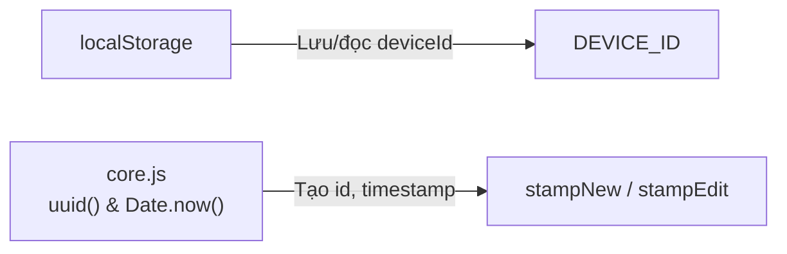
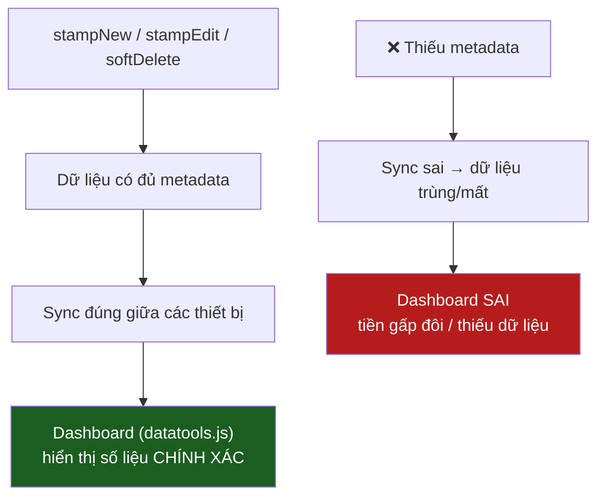
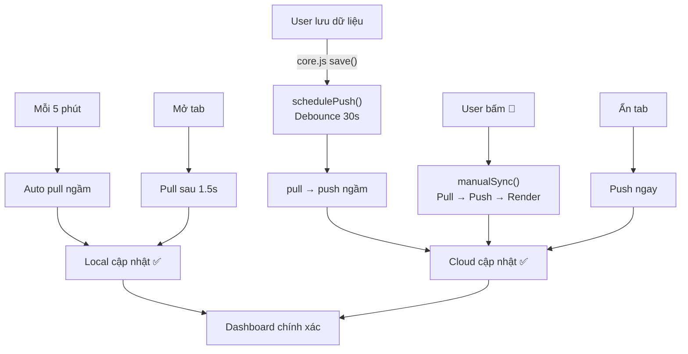

# 📖 Giải Thích File `sync.js` — Hệ Thống Đồng Bộ Dữ Liệu

> **Bối cảnh**: App quản lý chi phí công trình. Dữ liệu (hóa đơn, chấm công, thiết bị, tiền ứng…) lưu trên máy (IndexedDB) và đồng bộ giữa nhiều thiết bị qua Firebase.

---

## PHẦN 1: ĐỊNH DANH THIẾT BỊ & ĐÓNG DẤU DỮ LIỆU

> Dòng 1 → 52 trong [sync.js](file:///d:/NGUYEN%20HUU/APP%20QUAN%20LY%20CONG%20TRINH/Antigravity/sync.js#L1-L52)
> Bao gồm 3 khối: **Device Identity** (dòng 10–18), **Record Stamping** (dòng 25–40), **Soft Delete** (dòng 45–52)

---

### 1. 🎯 Mục đích

Phần này giải quyết **3 câu hỏi nền tảng** mà bất kỳ hệ thống đồng bộ nào cũng phải trả lời:

| Câu hỏi | Giải pháp trong code |
|---|---|
| **Ai** sửa dữ liệu này? | `DEVICE_ID` — mã định danh thiết bị |
| **Khi nào** dữ liệu được tạo / sửa / xóa? | `createdAt`, `updatedAt`, `deletedAt` — dấu thời gian |
| Dữ liệu bị **xóa** hay chỉ bị **ẩn**? | Soft delete — đánh dấu xóa thay vì xóa thật |

> [!IMPORTANT]
> Nếu thiếu bất kỳ thông tin nào trong 3 thứ trên, hệ thống sync **không thể** biết dữ liệu nào mới hơn, ai đã sửa, và có nên giữ hay bỏ — dẫn đến **mất dữ liệu** hoặc **trùng dữ liệu**.

---

### 2. 💡 Giải thích dễ hiểu

#### 🔹 DEVICE_ID — "Căn cước" của mỗi máy

Hãy tưởng tượng bạn có **2 điện thoại** cùng dùng app:
- Điện thoại A (của bạn ở công trường)
- Điện thoại B (của kế toán ở văn phòng)

Mỗi điện thoại được **cấp một mã số riêng** (giống số CMND), gọi là `DEVICE_ID`. Mã này:
- Được tạo **1 lần duy nhất** khi lần đầu mở app
- **Không bao giờ thay đổi** — dù tắt máy, đóng app, hay ngày hôm sau mở lại
- Dùng để hệ thống biết: "Hóa đơn này được sửa bởi máy nào?"

**Ví dụ thực tế**: Nếu bạn thêm hóa đơn xi măng trên điện thoại A, hóa đơn đó sẽ mang theo mã `DEVICE_ID` của điện thoại A. Khi kế toán trên điện thoại B nhận được hóa đơn này qua sync, hệ thống biết rõ "hóa đơn này do máy A tạo".

#### 🔹 Record Stamping — "Đóng dấu" lên mỗi bản ghi

Giống như khi bạn ký nhận một hóa đơn giấy, bạn viết:
- **Ngày lập** (createdAt)
- **Ngày sửa lần cuối** (updatedAt)
- **Ai ký** (deviceId)
- **Mã hóa đơn** (id)

Trong app, mỗi lần bạn **tạo mới** hoặc **chỉnh sửa** một dữ liệu bất kỳ (hóa đơn, chấm công, tiền ứng…), hệ thống tự động "đóng dấu" các thông tin này lên dữ liệu.

Có **2 loại dấu**:
- **`stampNew`**: Đóng dấu lần đầu — khi tạo dữ liệu mới (tạo mã ID mới + ghi ngày tạo + ngày sửa)
- **`stampEdit`**: Đóng dấu sửa — khi chỉnh sửa dữ liệu cũ (chỉ cập nhật ngày sửa + thiết bị nào sửa, **giữ nguyên** mã ID và ngày tạo ban đầu)

#### 🔹 Soft Delete — "Gạch bỏ" thay vì "xé bỏ"

Hãy tưởng tượng cuốn sổ ghi chép hóa đơn:
- ❌ **Xóa cứng** (Hard Delete) = **Xé trang** khỏi sổ → mất luôn, máy khác không biết trang đó từng tồn tại → khi sync, máy khác sẽ **gửi lại** trang đó (vì nó vẫn còn trên máy kia) → dữ liệu "sống lại"!
- ✅ **Xóa mềm** (Soft Delete) = **Gạch ngang** trang đó + ghi ngày gạch → trang vẫn còn trong sổ, nhưng biết rõ "đã bị xóa lúc nào". Khi sync, máy khác thấy dấu gạch → cũng gạch theo.

> [!WARNING]
> **Nếu dùng xóa cứng**: Bạn xóa hóa đơn trên máy A → sync → máy B vẫn còn hóa đơn đó → sync ngược lại → hóa đơn "sống lại" trên máy A! Đây là lý do app dùng **xóa mềm**.

---

### 3. 📱 Ví dụ thực tế trong app

#### Tình huống 1: Thêm hóa đơn mới
Bạn nhập hóa đơn mua xi măng 5 triệu trên điện thoại A:

```
Hệ thống tự động tạo:
├── id:        "abc-123-xyz"       ← mã duy nhất, không trùng bất kỳ hóa đơn nào khác
├── createdAt: 1714012800000       ← thời điểm tạo (kiểu timestamp)
├── updatedAt: 1714012800000       ← giống createdAt vì vừa tạo
├── deletedAt: null                ← chưa xóa
├── deviceId:  "phone-A-id"       ← máy A tạo
├── loai:      "Vật Liệu XD"
├── ten:       "Xi măng"
└── soTien:    5000000
```

#### Tình huống 2: Kế toán sửa hóa đơn
Kế toán trên máy B sửa lại số tiền từ 5 triệu → 5.5 triệu:

```
Hệ thống cập nhật:
├── id:        "abc-123-xyz"       ← GIỐNG HỆT — không tạo mã mới
├── createdAt: 1714012800000       ← GIỐNG HỆT — giữ nguyên ngày tạo ban đầu
├── updatedAt: 1714099200000       ← 🔄 CẬP NHẬT — thời điểm sửa (muộn hơn)
├── deletedAt: null                ← vẫn chưa xóa
├── deviceId:  "phone-B-id"       ← 🔄 ĐỔI — máy B sửa
├── soTien:    5500000             ← 🔄 ĐỔI — số tiền mới
```

#### Tình huống 3: Xóa hóa đơn
Bạn muốn xóa hóa đơn trên máy A:

```
Hệ thống KHÔNG xóa khỏi danh sách. Thay vào đó:
├── id:        "abc-123-xyz"       ← vẫn giữ
├── deletedAt: 1714185600000       ← ✅ GHI NHẬN thời điểm xóa
├── updatedAt: 1714185600000       ← cập nhật thời gian sửa
├── deviceId:  "phone-A-id"       ← máy A xóa
└── (tất cả dữ liệu khác vẫn còn)
```

Khi hiển thị danh sách, app chỉ lọc ra các hóa đơn có `deletedAt = null` → hóa đơn đã xóa sẽ **không hiện**, nhưng vẫn tồn tại trong bộ nhớ để sync đúng.

---

### 4. 💻 Code chính

#### Khối 1 — Device Identity (dòng 10–18)

```javascript
const DEVICE_ID = (() => {
  let id = localStorage.getItem('deviceId');
  if (!id) {
    id = crypto.randomUUID();
    localStorage.setItem('deviceId', id);
    console.log('[Sync] 🆕 Device mới đăng ký:', id);
  }
  return id;
})();
```

#### Khối 2 — Record Stamping (dòng 25–40)

```javascript
// Tạo record MỚI với đầy đủ metadata
function stampNew(fields) {
  const now = Date.now();
  return {
    id:        uuid(),          // mã duy nhất
    createdAt: now,             // thời điểm tạo
    updatedAt: now,             // thời điểm sửa = thời điểm tạo (vì mới)
    deletedAt: null,            // chưa xóa
    deviceId:  DEVICE_ID,       // thiết bị nào tạo
    ...fields,                  // gộp thêm dữ liệu thực (loại, tên, số tiền...)
  };
}

// Cập nhật record HIỆN CÓ (giữ id + createdAt)
function stampEdit(record) {
  return { ...record, updatedAt: Date.now(), deviceId: DEVICE_ID };
}
```

#### Khối 3 — Soft Delete (dòng 45–52)

```javascript
function softDeleteRecord(arr, id) {
  const now = Date.now();
  return arr.map(r =>
    String(r.id) === String(id)
      ? { ...r, deletedAt: now, updatedAt: now, deviceId: DEVICE_ID }
      : r
  );
}
```

---

### 5. 🔍 Diễn giải code

#### DEVICE_ID — Tạo "căn cước" máy

| Dòng | Ý nghĩa |
|---|---|
| `localStorage.getItem('deviceId')` | Kiểm tra xem máy này đã có mã chưa (tìm trong bộ nhớ cố định) |
| `crypto.randomUUID()` | Nếu chưa có → tạo mã ngẫu nhiên dạng `"a1b2c3d4-e5f6-..."` (gần như không bao giờ trùng) |
| `localStorage.setItem('deviceId', id)` | Lưu mã vĩnh viễn (tắt app mở lại vẫn còn) |
| `return id` | Trả mã ra để cả file sync.js dùng chung |

> [!NOTE]
> `localStorage` là bộ nhớ **vĩnh viễn** trên trình duyệt. Khác với RAM (tắt máy mất), localStorage giữ dữ liệu cho đến khi user chủ động xóa. Nên `DEVICE_ID` chỉ tạo **1 lần duy nhất**.

#### stampNew — Đóng dấu "tạo mới"

| Trường | Giá trị | Vai trò |
|---|---|---|
| `id` | `uuid()` — mã duy nhất | Như "mã vạch" của hóa đơn. Dùng để phân biệt dữ liệu khi sync |
| `createdAt` | `Date.now()` — thời gian hiện tại (ms) | Biết hóa đơn tạo lúc nào |
| `updatedAt` | `Date.now()` — giống createdAt | Lúc mới tạo, "sửa lần cuối" = "ngày tạo" |
| `deletedAt` | `null` | Chưa xóa (null = chưa có ngày xóa) |
| `deviceId` | `DEVICE_ID` | Thiết bị nào tạo |
| `...fields` | Dữ liệu thực | Tên hóa đơn, số tiền, công trình... |

#### stampEdit — Đóng dấu "chỉnh sửa"

| Thay đổi | Giữ nguyên | Lý do |
|---|---|---|
| `updatedAt` → thời gian mới | `id` | Không tạo bản ghi mới, chỉ sửa bản cũ |
| `deviceId` → máy hiện tại | `createdAt` | Vẫn biết bản ghi được tạo lần đầu khi nào |

> [!TIP]
> Tại sao `stampEdit` **không đổi** `id`? Vì `id` là "mã vạch" — nếu đổi id khi sửa, hệ thống sync sẽ tưởng đây là hóa đơn MỚI → **tạo ra 2 bản** (bản cũ + bản mới) → **tiền bị tính gấp đôi**!

#### softDeleteRecord — "Gạch bỏ" bản ghi

| Dòng | Ý nghĩa |
|---|---|
| `arr.map(r => ...)` | Duyệt qua **toàn bộ** danh sách (ví dụ: tất cả hóa đơn) |
| `String(r.id) === String(id)` | Tìm đúng bản ghi cần xóa bằng mã ID |
| `deletedAt: now` | Ghi nhận **thời điểm xóa** (thay vì xóa khỏi mảng) |
| `updatedAt: now` | Cập nhật thời gian sửa — để sync biết "bản ghi này vừa thay đổi" |
| `deviceId: DEVICE_ID` | Ghi nhận máy nào thực hiện xóa |
| `: r` (dòng cuối) | Các bản ghi khác **giữ nguyên**, không đụng vào |

---

### 6. ✅ Kết luận

Hiểu phần này giúp bạn **tránh được các lỗi nghiêm trọng**:

| Lỗi | Nguyên nhân nếu thiếu phần này | Hậu quả |
|---|---|---|
| 🔴 **Tiền bị tính gấp đôi** | Không có `id` → mỗi lần sửa tạo bản mới | Báo cáo sai, chi phí phình lên |
| 🔴 **Dữ liệu "sống lại"** | Xóa cứng (xóa thật) thay vì xóa mềm | Hóa đơn đã xóa quay lại sau khi sync |
| 🟡 **Không biết bản nào mới hơn** | Không có `updatedAt` | 2 máy cùng sửa → không biết giữ bản nào |
| 🟡 **Không truy vết được** | Không có `deviceId` | Khi lỗi xảy ra, không biết máy nào gây ra |

> [!CAUTION]
> **Quy tắc vàng**: Mọi dữ liệu trong app đều **BẮT BUỘC** phải có đủ 5 trường: `id`, `createdAt`, `updatedAt`, `deletedAt`, `deviceId`. Thiếu bất kỳ trường nào → sync sẽ gặp lỗi.

---

### 7. 🔗 Liên kết module

#### Dữ liệu lấy từ đâu?



- `DEVICE_ID` được lưu trong `localStorage` — bộ nhớ cố định của trình duyệt
- `uuid()` (tạo mã ID) được định nghĩa trong [core.js](file:///d:/NGUYEN%20HUU/APP%20QUAN%20LY%20CONG%20TRINH/Antigravity/core.js)
- `Date.now()` là hàm có sẵn của JavaScript

#### Được dùng bởi module nào?

| Module | Dùng gì? | Ví dụ |
|---|---|---|
| [hoadon.js](file:///d:/NGUYEN%20HUU/APP%20QUAN%20LY%20CONG%20TRINH/Antigravity/hoadon.js) | `DEVICE_ID`, `deletedAt`, `updatedAt` | Xóa mềm hóa đơn (dòng 830), khôi phục hóa đơn (dòng 982) |
| [chamcong.js](file:///d:/NGUYEN%20HUU/APP%20QUAN%20LY%20CONG%20TRINH/Antigravity/chamcong.js) | `DEVICE_ID`, `deletedAt`, `updatedAt` | Xóa mềm chấm công (dòng 1028) |
| [thietbi.js](file:///d:/NGUYEN%20HUU/APP%20QUAN%20LY%20CONG%20TRINH/Antigravity/thietbi.js) | `DEVICE_ID`, `softDeleteRecord()` | Xóa mềm thiết bị (dòng 469, 565) |
| [doanhthu.js](file:///d:/NGUYEN%20HUU/APP%20QUAN%20LY%20CONG%20TRINH/Antigravity/doanhthu.js) | `DEVICE_ID`, `deletedAt`, `updatedAt` | Xóa mềm bản ghi thu (dòng 843) |
| [danhmuc.js](file:///d:/NGUYEN%20HUU/APP%20QUAN%20LY%20CONG%20TRINH/Antigravity/danhmuc.js) | `DEVICE_ID` | Gán deviceId khi tạo tiền ứng (dòng 762) |
| [nhapxuat.js](file:///d:/NGUYEN%20HUU/APP%20QUAN%20LY%20CONG%20TRINH/Antigravity/nhapxuat.js) | `DEVICE_ID` | Import dữ liệu — gán deviceId cho record nhập (nhiều chỗ) |
| [datatools.js](file:///d:/NGUYEN%20HUU/APP%20QUAN%20LY%20CONG%20TRINH/Antigravity/datatools.js) | `DEVICE_ID` | Dashboard — gán deviceId khi thao tác dữ liệu (dòng 107, 256) |

#### Ảnh hưởng đến Dashboard



Dashboard lọc `deletedAt == null` để tính tổng. Nếu hóa đơn xóa mà không có `deletedAt` → hóa đơn vẫn bị **tính vào tổng chi** → **báo cáo sai**.

---

---
---

## PHẦN 2: XỬ LÝ XUNG ĐỘT & THUẬT TOÁN GỘP DỮ LIỆU

> Dòng 54 → 134 trong [sync.js](file:///d:/NGUYEN%20HUU/APP%20QUAN%20LY%20CONG%20TRINH/Antigravity/sync.js#L54-L134)
> Bao gồm 5 khối: **Conflict Resolution** (dòng 57–73), **Merge Algorithm** (dòng 82–91), **Multi-Year Helper** (dòng 96–108), **Merge Key** (dòng 113–119), **Merge Users** (dòng 122–134)

---

### 1. 🎯 Mục đích

Phần này giải quyết **câu hỏi khó nhất** của đồng bộ dữ liệu:

> **Khi 2 thiết bị cùng sửa 1 dữ liệu, giữ bản nào?**

| Tình huống | Giải pháp |
|---|---|
| Máy A sửa hóa đơn, máy B cũng sửa hóa đơn đó | So sánh `updatedAt` — **bản sửa sau cùng thắng** |
| Máy A xóa hóa đơn, máy B chưa biết vẫn giữ bản cũ | **Bên xóa luôn thắng** (tombstone priority) |
| Cloud có dữ liệu mới, local cũng có dữ liệu mới | **Gộp cả hai** — không mất bên nào |

---

### 2. 💡 Giải thích dễ hiểu

#### 🔹 resolveConflict — "Trọng tài" phân xử khi xung đột

Hình dung bạn có **2 nhân viên** cùng ghi sổ chi phí:
- Nhân viên A (công trường) ghi: "Xi măng = 5 triệu"
- Nhân viên B (văn phòng) sửa: "Xi măng = 5.5 triệu"

Khi cuối ngày **gộp sổ**, phải chọn 1 bản. Quy tắc:

**Quy tắc 1 — "Ai xóa thì nghe người đó"** (Tombstone Priority)
- Nếu 1 bên đã gạch bỏ (xóa) mà bên kia chưa → **luôn giữ bên đã xóa**
- Lý do: Tránh dữ liệu "sống lại". Nếu bạn đã xóa 1 hóa đơn sai, bạn không muốn nó quay lại!

**Quy tắc 2 — "Ai sửa sau cùng thì thắng"** (Last Write Wins)
- Nếu cả 2 bên đều chưa xóa (hoặc đều đã xóa) → so sánh `updatedAt` → **bản mới hơn thắng**

#### 🔹 mergeDatasets — "Gộp 2 cuốn sổ thành 1"

Hình dung 2 cuốn sổ (local & cloud), mỗi cuốn có nhiều hóa đơn:

```
Sổ LOCAL (trên máy):           Sổ CLOUD (trên mây):
├── HĐ-001: Xi măng 5tr        ├── HĐ-001: Xi măng 5.5tr  ← cùng ID, khác giá
├── HĐ-002: Sắt thép 10tr      ├── HĐ-003: Gạch 3tr       ← chỉ có trên cloud
└── (HĐ-002 chỉ có local)      └── (HĐ-003 chỉ có cloud)
```

Kết quả sau khi gộp:
```
Sổ SAU GỘP:
├── HĐ-001: Xi măng 5.5tr   ← cloud mới hơn → giữ cloud
├── HĐ-002: Sắt thép 10tr   ← chỉ local có → GIỮ (không mất)
└── HĐ-003: Gạch 3tr        ← chỉ cloud có → THÊM VÀO
```

> [!IMPORTANT]
> **Không mất bất kỳ dữ liệu nào**: Bản chỉ có trên local → giữ. Bản chỉ có trên cloud → thêm. Bản cả 2 đều có → "trọng tài" `resolveConflict` phân xử.

#### 🔹 _getAllLocalYears — "Kiểm tra sổ có dữ liệu những năm nào"

App lưu dữ liệu theo năm (2024, 2025, 2026…). Hàm này quét tất cả dữ liệu trên máy để biết "có dữ liệu của năm nào" → sync **tất cả năm** chứ không chỉ năm hiện tại.

#### 🔹 _mergeKey — "Gộp sổ cho 1 loại dữ liệu cụ thể"

Đây là hàm tiện ích: nhận tên loại dữ liệu (ví dụ: `inv_v3` = hóa đơn), lấy local + cloud → gộp → lưu lại. Trả về số bản ghi mới thêm.

#### 🔹 _mergeUsersSafe — "Gộp danh sách người dùng an toàn"

Gộp danh sách user giữa local và cloud, dùng `updatedAt` để giữ bản mới nhất. Có cơ chế dự phòng nếu hàm `mergeUsers` chính chưa sẵn sàng.

---

### 3. 📱 Ví dụ thực tế trong app

#### Tình huống 1: Hai máy cùng sửa hóa đơn (Conflict)

```
⏰ 08:00 — Máy A sửa HĐ xi măng: 5tr → 5.5tr (updatedAt = 08:00)
⏰ 09:00 — Máy B sửa HĐ xi măng: 5tr → 6tr   (updatedAt = 09:00)
⏰ 10:00 — Sync chạy:
   → resolveConflict: 09:00 > 08:00 → GIỮ BẢN MÁY B (6tr) ✅
```

#### Tình huống 2: Máy A xóa, máy B chưa biết (Tombstone)

```
⏰ 08:00 — Máy A xóa HĐ nhập sai (deletedAt = 08:00)
⏰ 09:00 — Máy B chưa sync, vẫn thấy HĐ đó, vô tình sửa giá
⏰ 10:00 — Sync chạy:
   → resolveConflict: Máy A có deletedAt, máy B không có
   → Tombstone priority → GIỮ BẢN ĐÃ XÓA ✅
   → Hóa đơn sai KHÔNG sống lại
```

#### Tình huống 3: Dữ liệu nhiều năm

```
Local có dữ liệu: 2024 (30 HĐ), 2025 (50 HĐ), 2026 (20 HĐ)
→ _getAllLocalYears() trả về: ["2024", "2025", "2026"]
→ Sync gộp DỮ LIỆU CẢ 3 NĂM, không bỏ sót năm cũ
```

---

### 4. 💻 Code chính

#### Khối 1 — Conflict Resolution (dòng 57–73)

```javascript
function resolveConflict(local, cloud) {
  // Quy tắc 1: Bên nào đã xóa → bên đó thắng
  if (local.deletedAt && !cloud.deletedAt) return local;
  if (!local.deletedAt && cloud.deletedAt) return cloud;

  // Quy tắc 2: Cùng trạng thái → bản mới hơn thắng
  const lt = local.updatedAt || local.createdAt || local._ts || 0;
  const ct = cloud.updatedAt || cloud.createdAt || 0;
  return lt >= ct ? local : cloud;
}
```

#### Khối 2 — Merge Algorithm (dòng 82–91)

```javascript
function mergeDatasets(local, cloud) {
  const map = new Map();
  (local || []).forEach(r => map.set(String(r.id), r));
  (cloud || []).forEach(cloudR => {
    const key    = String(cloudR.id);
    const localR = map.get(key);
    map.set(key, localR ? resolveConflict(localR, cloudR) : cloudR);
  });
  return [...map.values()];
}
```

#### Khối 3 — Multi-Year Helper (dòng 96–108)

```javascript
function _getAllLocalYears() {
  const yrs = new Set();
  const addYr = (arr, field) =>
    (arr || []).forEach(r => {
      const d = r[field];
      if (d && d.length >= 4) yrs.add(d.slice(0, 4));
    });
  addYr(load('inv_v3', []), 'ngay');     // hóa đơn
  addYr(load('ung_v1', []), 'ngay');     // tiền ứng
  addYr(load('cc_v2',  []), 'fromDate'); // chấm công
  addYr(load('tb_v1',  []), 'ngay');     // thiết bị
  addYr(load('thu_v1', []), 'ngay');     // thu
  yrs.add(String(activeYear || new Date().getFullYear()));
  return [...yrs].filter(Boolean).sort();
}
```

---

### 5. 🔍 Diễn giải code

#### resolveConflict — Trọng tài phân xử

| Dòng | Ý nghĩa |
|---|---|
| `if (local.deletedAt && !cloud.deletedAt) return local` | Local đã xóa, cloud chưa → **giữ local** (bản đã xóa thắng) |
| `if (!local.deletedAt && cloud.deletedAt) return cloud` | Cloud đã xóa, local chưa → **giữ cloud** (bản đã xóa thắng) |
| `local._ts \|\| 0` | Fallback: record cũ có thể dùng `_ts` thay vì `updatedAt` → hỗ trợ dữ liệu cũ |
| `lt >= ct ? local : cloud` | Nếu local mới hơn hoặc **bằng** → giữ local. Cloud chỉ thắng khi **thật sự mới hơn** |

> [!TIP]
> Tại sao "bằng thì local thắng"? Vì local là dữ liệu **đang trên tay bạn**. Nếu bằng nhau, không có lý do ghi đè cái đang có bằng cái từ xa.

#### mergeDatasets — Gộp 2 danh sách

| Bước | Code | Ý nghĩa |
|---|---|---|
| 1 | `const map = new Map()` | Tạo "bảng tra" rỗng |
| 2 | `local.forEach(r => map.set(r.id, r))` | Đưa TẤT CẢ bản ghi local vào bảng |
| 3 | `cloud.forEach(...)` | Duyệt từng bản ghi cloud |
| 3a | `localR = map.get(key)` | Kiểm tra: cloud record này có tồn tại trên local không? |
| 3b | `localR ? resolveConflict(localR, cloudR) : cloudR` | Có → gọi "trọng tài". Không → thêm mới từ cloud |
| 4 | `return [...map.values()]` | Trả về danh sách đã gộp |

> [!NOTE]
> **"Idempotent"** nghĩa là: chạy gộp bao nhiêu lần cũng ra kết quả giống nhau. Gộp 2 lần hay 10 lần → danh sách cuối cùng vẫn y hệt. Điều này rất quan trọng vì sync có thể chạy nhiều lần.

#### _getAllLocalYears — Quét năm

| Dòng | Ý nghĩa |
|---|---|
| `new Set()` | Tập hợp (không trùng) — mỗi năm chỉ xuất hiện 1 lần |
| `r[field].slice(0, 4)` | Lấy 4 ký tự đầu của ngày (ví dụ `"2025-03-15"` → `"2025"`) |
| `load('inv_v3', [])` | Đọc toàn bộ hóa đơn từ bộ nhớ |
| `yrs.add(String(activeYear))` | Luôn thêm năm đang chọn — đảm bảo năm hiện tại luôn được sync |

---

### 6. ✅ Kết luận

| Lỗi bị ngăn chặn | Nhờ cơ chế nào |
|---|---|
| 🔴 **Hóa đơn đã xóa "sống lại"** | Tombstone priority — bên xóa luôn thắng |
| 🔴 **Mất dữ liệu khi gộp** | `mergeDatasets` giữ cả local-only và cloud-only |
| 🟡 **2 máy sửa khác nhau, không biết giữ bản nào** | `resolveConflict` tự quyết — bản mới nhất thắng |
| 🟡 **Dữ liệu năm cũ không được sync** | `_getAllLocalYears` quét TẤT CẢ năm có dữ liệu |
| 🟢 **Gộp nhiều lần bị lỗi** | Idempotent — gộp bao nhiêu lần cũng cùng kết quả |

> [!CAUTION]
> **Ngoại lệ quan trọng**: Dữ liệu **chấm công** (`cc_v2`) **KHÔNG** dùng `mergeDatasets`. Lý do: 2 máy có thể tạo chấm công cùng tuần + cùng công trình nhưng **khác ID** → gộp bằng ID sẽ tạo bản trùng. Phần 3 sẽ giải thích cách xử lý riêng cho chấm công.

---

### 7. 🔗 Liên kết module

#### Dữ liệu lấy từ đâu?

- `load()` — đọc dữ liệu từ IndexedDB, định nghĩa trong [core.js](file:///d:/NGUYEN%20HUU/APP%20QUAN%20LY%20CONG%20TRINH/Antigravity/core.js)
- `_memSet()` — ghi vào bộ nhớ RAM + IndexedDB, cũng từ core.js
- `activeYear` — năm đang chọn trên giao diện, từ core.js

#### Được dùng bởi ai?

| Hàm | Gọi ở đâu trong sync.js | Mục đích |
|---|---|---|
| `resolveConflict` | `mergeDatasets()` (dòng 88) | Phân xử từng cặp record trùng ID |
| `mergeDatasets` | `_mergeKey()`, `pullChanges()`, `pushChanges()` | Gộp hóa đơn, tiền ứng, thiết bị, thầu phụ, projects |
| `_getAllLocalYears` | `pushChanges()` (dòng 266), `pullChanges()` (dòng 406) | Xác định sync những năm nào |
| `_mergeKey` | `pushChanges()` (dòng 282–292) | Gộp từng loại dữ liệu khi push |

#### Ảnh hưởng đến Dashboard

Nếu `mergeDatasets` hoạt động sai → dữ liệu trùng hoặc thiếu → **Dashboard** ([datatools.js](file:///d:/NGUYEN%20HUU/APP%20QUAN%20LY%20CONG%20TRINH/Antigravity/datatools.js)) hiển thị tổng chi phí SAI. Ví dụ: hóa đơn xi măng xuất hiện 2 lần → tổng chi bị gấp đôi.

---

> 📌 **Phần tiếp theo**: PHẦN 3 sẽ giải thích **Chuẩn hóa Chấm Công (normalizeCC)** — tại sao chấm công cần xử lý đặc biệt?
>
> Nhắn **"tiếp"** để sang PHẦN 3.

---
---

## PHẦN 3: KHÓA SYNC, HÀNG ĐỢI & CHUẨN HÓA CHẤM CÔNG

> Dòng 136 → 240 trong [sync.js](file:///d:/NGUYEN%20HUU/APP%20QUAN%20LY%20CONG%20TRINH/Antigravity/sync.js#L136-L240)
> Bao gồm 3 nhóm: **Sync Lock** (dòng 139–140), **Sync Queue** (dòng 145–158), **Normalize CC** (dòng 160–240)

---

### 1. 🎯 Mục đích

Phần này giải quyết **3 vấn đề**:

| Vấn đề | Giải pháp |
|---|---|
| Đang sync mà user thao tác → hỏng dữ liệu | **Sync Lock** — khóa thao tác nguy hiểm khi đang sync |
| Cần biết có bao nhiêu thay đổi chưa đẩy lên cloud | **Sync Queue** — hàng đợi đếm thay đổi |
| Chấm công bị trùng khi 2 máy nhập cùng tuần | **normalizeCC** — gộp theo tuần+công trình thay vì theo ID |

---

### 2. 💡 Giải thích dễ hiểu

#### 🔹 Sync Lock — "Treo biển Đang Sửa Chữa"

Hãy tưởng tượng bạn đang **chuyển tiền** qua ngân hàng. Trong lúc giao dịch đang xử lý, app ngân hàng **khóa** không cho bạn bấm nút chuyển tiền lần nữa — để tránh chuyển 2 lần.

Tương tự, khi app đang gửi/nhận dữ liệu (sync), hệ thống **khóa** lại:
- Không cho push thêm lần nữa (tránh gửi trùng)
- Không cho pull thêm (tránh nhận dữ liệu chồng chéo)
- Các module khác (datatools.js, main.js) kiểm tra `isSyncing()` trước khi thao tác nguy hiểm

#### 🔹 Sync Queue — "Sổ ghi chú những gì chưa gửi"

Giống như bạn ghi ra giấy: "3 hóa đơn mới, 1 chấm công sửa" → biết còn 4 thứ chưa đẩy lên cloud. Khi sync xong → xóa sạch giấy.

- `enqueueChange()`: Ghi 1 thay đổi vào sổ
- `getPendingCount()`: Đếm còn bao nhiêu thay đổi chưa sync
- `_clearQueue()`: Xóa sổ sau khi sync thành công
- Giới hạn tối đa **500 mục** — tránh sổ quá dài

#### 🔹 normalizeCC — "Quy tắc: 1 tuần + 1 công trình = 1 bảng chấm công"

Đây là phần **quan trọng nhất** và **phức tạp nhất** của PHẦN 3.

**Vấn đề**: Hóa đơn, thiết bị, tiền ứng… mỗi bản ghi có `id` duy nhất → gộp bằng `id` là đủ. Nhưng **chấm công thì khác**:

```
Máy A tạo chấm công tuần 14/04 cho CT Bình Tân → id = "aaa-111"
Máy B tạo chấm công tuần 14/04 cho CT Bình Tân → id = "bbb-222"
```

**2 ID khác nhau**, nhưng thực chất là **cùng 1 bảng chấm công**! Nếu gộp bằng ID (như `mergeDatasets`), kết quả sẽ có **2 bản** → **công nhân bị tính gấp đôi ngày công**.

**Giải pháp**: Dùng **logical key** = `fromDate` (ngày bắt đầu tuần) + `projectId` (mã công trình) thay vì `id`.

```
Logical key = "2025-04-14__CT-BinhTan"
→ Dù ID khác nhau, 2 bản cùng key → GIỮ BẢN MỚI HƠN, BỎ BẢN CŨ
```

> [!WARNING]
> **Nếu không có `normalizeCC`**: 2 máy nhập chấm công cùng tuần → sau sync sẽ có **2 bảng chấm công** → lương tính gấp đôi!

**3 vấn đề phụ mà normalizeCC xử lý thêm**:

| Vấn đề | Hàm xử lý | Giải thích |
|---|---|---|
| Record cũ có tên CT nhưng thiếu mã CT | `_fillCCProjectId()` | Tự tra bảng projects để điền `projectId` |
| Đồng hồ máy sai (năm 1970 hoặc năm 2030) | `_safeTs()` | Lọc timestamp bất hợp lệ trước khi so sánh |
| Cùng timestamp nhưng 1 bên đã xóa | Tombstone tie-break | Bản đã xóa thắng khi thời gian bằng nhau |

---

### 3. 📱 Ví dụ thực tế trong app

#### Tình huống 1: 2 máy cùng nhập chấm công tuần 14/04 cho CT Bình Tân

```
Máy A (công trường): Tạo CC tuần 14/04, CT Bình Tân
   → id="aaa", fromDate="2025-04-14", projectId="CT01", updatedAt=08:00
   → Thợ Hùng: 6 ngày, Thợ Minh: 5 ngày

Máy B (văn phòng): Tạo CC tuần 14/04, CT Bình Tân
   → id="bbb", fromDate="2025-04-14", projectId="CT01", updatedAt=09:00
   → Thợ Hùng: 6 ngày, Thợ Minh: 5.5 ngày (sửa lại)

normalizeCC chạy:
   → Key = "2025-04-14__CT01" → trùng!
   → So sánh: 09:00 > 08:00 → GIỮ BẢN MÁY B ✅
   → Kết quả: CHỈ 1 bảng chấm công (máy B), không bị gấp đôi
```

#### Tình huống 2: Đồng hồ máy bị sai

```
Máy A: updatedAt = 1577000000000 (≈ năm 2019) → ĐỒNG HỒ SAI!
Máy B: updatedAt = 1714099200000 (≈ 04/2025)  → bình thường

_safeTs chạy:
   → Máy A: 1577000000000 < _TS_EPOCH (2020-01-01) → trả 0 (thua)
   → Máy B: bình thường → giữ nguyên
   → Kết quả: Máy B thắng ✅ (không bị đồng hồ sai ảnh hưởng)
```

#### Tình huống 3: Record cũ thiếu projectId

```
Record cũ (trước khi app có projectId):
   → ct = "CT Bình Tân", projectId = undefined

_fillCCProjectId chạy:
   → Tra bảng projects: "CT Bình Tân" → id = "CT01"
   → Tự điền: projectId = "CT01"
   → Giờ logical key ổn định: "2025-04-14__CT01"
```

---

### 4. 💻 Code chính

#### Khối 1 — Sync Lock (dòng 139–140)

```javascript
let _syncPulling = false;
function isSyncing() { return _syncPushing || _syncPulling; }
```

#### Khối 2 — Sync Queue (dòng 147–158)

```javascript
function enqueueChange(recordId, type) {
  const q   = _loadLS(_PENDING_KEY) || [];
  const idx = q.findIndex(c => String(c.id) === String(recordId));
  const entry = { id: String(recordId), type, ts: Date.now() };
  if (idx >= 0) q[idx] = entry; else q.push(entry);
  if (q.length > 500) q.splice(0, q.length - 500);
  _saveLS(_PENDING_KEY, q);
}
```

#### Khối 3 — Safe Timestamp (dòng 173–178)

```javascript
function _safeTs(ts) {
  const n = typeof ts === 'number' ? ts : parseInt(ts) || 0;
  if (n < _TS_EPOCH)             return 0;          // quá cũ → thua
  if (n > Date.now() + 86400000) return Date.now();  // tương lai → kéo về hiện tại
  return n;
}
```

#### Khối 4 — normalizeCC (dòng 211–237)

```javascript
function normalizeCC(records) {
  const filled = _fillCCProjectId(records || []);
  const byKey = new Map();
  filled.forEach(r => {
    const date = r.fromDate || r.from || '';
    const proj = r.projectId || r.ct  || '';
    const key  = `${date}__${proj}`;         // logical key

    const prev = byKey.get(key);
    if (!prev) { byKey.set(key, r); return; }

    const prevTs = _safeTs(prev.updatedAt || prev.createdAt || 0);
    const rTs    = _safeTs(r.updatedAt   || r.createdAt   || 0);

    if (rTs > prevTs) {
      byKey.set(key, r);                     // mới hơn thắng
    } else if (rTs === prevTs && r.deletedAt && !prev.deletedAt) {
      byKey.set(key, r);                     // hòa + đã xóa → xóa thắng
    }
  });
  return [...byKey.values()];
}
```

---

### 5. 🔍 Diễn giải code

#### isSyncing — Kiểm tra khóa

| Biến | Ý nghĩa |
|---|---|
| `_syncPushing` | `true` khi đang **đẩy** dữ liệu lên cloud (định nghĩa ở dòng 245) |
| `_syncPulling` | `true` khi đang **kéo** dữ liệu từ cloud |
| `isSyncing()` | Trả `true` nếu **bất kỳ hướng nào** đang chạy → chặn thao tác mới |

#### enqueueChange — Ghi vào hàng đợi

| Dòng | Ý nghĩa |
|---|---|
| `q.findIndex(...)` | Tìm xem record này đã có trong hàng đợi chưa |
| `if (idx >= 0) q[idx] = entry` | Đã có → **cập nhật** (không thêm trùng) |
| `else q.push(entry)` | Chưa có → **thêm mới** |
| `q.length > 500 → splice` | Quá 500 → xóa bớt cũ nhất, giữ 500 mới nhất |

#### normalizeCC — Chuẩn hóa chấm công

| Dòng | Ý nghĩa |
|---|---|
| `_fillCCProjectId(records)` | Bước 0: Điền `projectId` cho record thiếu |
| `` key = `${date}__${proj}` `` | **Logical key** — "ngày bắt đầu tuần + mã công trình" |
| `if (!prev) byKey.set(key, r)` | Chưa có key này → thêm record |
| `_safeTs(...)` | Lọc timestamp an toàn trước khi so sánh |
| `rTs > prevTs → set` | Record mới hơn → **thay thế** record cũ |
| `rTs === prevTs && r.deletedAt` | Hòa + bên mới đã xóa → **xóa thắng** (tombstone) |

> [!TIP]
> **Tại sao dùng `fromDate + projectId` mà không dùng `id`?** Vì chấm công là dữ liệu "theo tuần". Mỗi tuần + mỗi công trình chỉ có 1 bảng chấm công. 2 máy tạo độc lập → 2 ID khác nhau nhưng **cùng tuần + cùng CT** = cùng bảng → phải gộp bằng logical key.

---

### 6. ✅ Kết luận

| Lỗi bị ngăn chặn | Nhờ cơ chế nào |
|---|---|
| 🔴 **Ngày công bị gấp đôi** | `normalizeCC` gộp bằng tuần+CT, không bằng ID |
| 🔴 **Dữ liệu hỏng do thao tác khi đang sync** | `isSyncing()` chặn thao tác nguy hiểm |
| 🟡 **Đồng hồ máy sai → so sánh thời gian bị lệch** | `_safeTs()` lọc timestamp bất hợp lệ |
| 🟡 **Record cũ thiếu projectId → logical key sai** | `_fillCCProjectId()` tự điền từ bảng projects |
| 🟢 **Không biết còn bao nhiêu thay đổi chưa sync** | `getPendingCount()` đếm chính xác |

> [!CAUTION]
> **Quy tắc cứng**: Mỗi tuần + mỗi công trình = tối đa 1 record chấm công. Nếu vi phạm → lương, ngày công sẽ tính sai. `normalizeCC` là tuyến phòng thủ cuối cùng đảm bảo quy tắc này.

---

### 7. 🔗 Liên kết module

#### Dữ liệu lấy từ đâu?

- `projects` — danh sách công trình, từ [core.js](file:///d:/NGUYEN%20HUU/APP%20QUAN%20LY%20CONG%20TRINH/Antigravity/core.js) / [projects.js](file:///d:/NGUYEN%20HUU/APP%20QUAN%20LY%20CONG%20TRINH/Antigravity/projects.js)
- `_loadLS` / `_saveLS` — đọc/ghi localStorage, từ core.js
- `_syncPushing` — biến trạng thái, định nghĩa ở dòng 245 (PHẦN 4)

#### Được dùng bởi ai?

| Hàm | Module gọi | Mục đích |
|---|---|---|
| `normalizeCC` | **sync.js** (push dòng 288, pull dòng 594) | Chuẩn hóa CC trước khi ghi |
| `normalizeCC` | **chamcong.js** (qua `_dedupCC`, dòng 17) | Chuẩn hóa khi load CC |
| `normalizeCC` | **core.js** (`_reloadGlobals`, dòng 475) | Chuẩn hóa khi refresh dữ liệu |
| `isSyncing()` | **datatools.js** (dòng 80, 224) | Chặn reset/import khi đang sync |
| `isSyncing()` | **main.js** (dòng 901) | Chặn push khi đang sync |
| `isSyncing()` | **sync.js** (nhiều chỗ) | Chặn push/pull trùng lặp |

#### Ảnh hưởng đến Dashboard

Nếu `normalizeCC` không chạy hoặc chạy sai → chấm công bị trùng → Dashboard ([datatools.js](file:///d:/NGUYEN%20HUU/APP%20QUAN%20LY%20CONG%20TRINH/Antigravity/datatools.js)) tính **tổng ngày công** và **tổng lương** sai (gấp đôi). Module [chamcong.js](file:///d:/NGUYEN%20HUU/APP%20QUAN%20LY%20CONG%20TRINH/Antigravity/chamcong.js) cũng hiển thị 2 bảng chấm công cho cùng 1 tuần.

---

> 📌 **Phần tiếp theo**: PHẦN 4 sẽ giải thích **Push — Đẩy dữ liệu lên cloud**.
>
> Nhắn **"tiếp"** để sang PHẦN 4.

---
---

## PHẦN 4: PUSH — ĐẨY DỮ LIỆU LÊN CLOUD

> Dòng 242 → 366 trong [sync.js](file:///d:/NGUYEN%20HUU/APP%20QUAN%20LY%20CONG%20TRINH/Antigravity/sync.js#L242-L366)

---

### 1. 🎯 Mục đích

Push là quá trình **gửi dữ liệu từ máy bạn lên cloud** (Firebase) để các thiết bị khác nhận được.

> [!IMPORTANT]
> Push **KHÔNG** đơn giản là "ghi đè lên cloud". Nó phải **tải cloud về trước → gộp → rồi mới ghi lên** — để không mất dữ liệu của thiết bị khác.

---

### 2. 💡 Giải thích dễ hiểu

Hãy tưởng tượng bạn và đồng nghiệp cùng **viết vào 1 cuốn sổ chung** đặt trên kệ (cloud):

**❌ Cách sai**: Bạn mang bản nháp lên kệ, **vứt cuốn sổ cũ**, đặt bản của bạn lên → mất hết dữ liệu đồng nghiệp viết!

**✅ Cách đúng (push của app)**:
1. **Lấy sổ từ kệ xuống** (fetch cloud)
2. **So sánh + gộp** bản nháp của bạn vào sổ (merge)
3. **Đặt sổ đã gộp lên kệ** (push lên cloud)

Quy trình này lặp lại cho **từng năm** dữ liệu (2024, 2025, 2026…).

**2 chế độ hoạt động**:

| Chế độ | Khi nào | UI |
|---|---|---|
| **Bình thường** (`silent: false`) | User bấm nút 🔄 Sync | Hiện banner "⏳ Đang đẩy..." → "✅ Đã đồng bộ" |
| **Ngầm** (`silent: true`) | Tự động sau 30s khi lưu | Không hiện gì (trừ khi lỗi) |

**Tùy chọn `skipPull`**: Sau khi import file JSON, local là nguồn sự thật → bỏ qua bước fetch cloud, ghi thẳng lên.

---

### 3. 📱 Ví dụ thực tế trong app

#### Tình huống 1: Push bình thường

```
Bạn nhập 3 hóa đơn mới trên máy A → bấm Sync:

Bước 1 (Fetch): Tải cloud năm 2025 xuống → có 50 HĐ (của máy B)
Bước 2 (Merge): Gộp 50 HĐ cloud + 3 HĐ mới = 53 HĐ
Bước 3 (Push):  Ghi 53 HĐ lên cloud
→ Kết quả: Cloud có ĐẦY ĐỦ 53 HĐ ✅
→ Banner: "✅ Đã đồng bộ lúc 10:30"
```

#### Tình huống 2: Nếu KHÔNG fetch trước (lỗi ghi đè)

```
❌ Push thẳng 3 HĐ mới lên cloud:
→ Cloud chỉ còn 3 HĐ → MẤT 50 HĐ của máy B!
```

#### Tình huống 3: Push sau import JSON

```
Bạn import file backup có 200 HĐ → skipPull = true:
→ Bỏ qua fetch cloud (vì file import là nguồn sự thật)
→ Ghi thẳng 200 HĐ lên cloud ✅
```

---

### 4. 💻 Code chính

#### Cấu trúc tổng thể pushChanges (rút gọn)

```javascript
async function pushChanges(opts = {}) {
  // Guard: Firebase chưa sẵn sàng hoặc đang sync → bỏ qua
  if (!fbReady()) return;
  if (_syncPushing) return;
  _syncPushing = true;  // BẬT KHÓA

  const years = _getAllLocalYears(); // ["2024", "2025", "2026"]

  for (const yr of years) {
    // STEP 1: Fetch cloud → merge vào local (tránh ghi đè)
    if (!skipPull) {
      const cloudData = await fsGet(fbDocYear(yr));
      if (cloudData.i) _mergeKey('inv_v3', expandInv(cloudData.i));
      if (cloudData.u) _mergeKey('ung_v1', expandUng(cloudData.u));
      if (cloudData.c) {
        // CC dùng normalizeCC thay vì _mergeKey
        const normalized = normalizeCC([...localCC, ...cloudCC]);
        _memSet('cc_v2', normalized);
      }
      // tb_v1, thu_v1 tương tự...
    }

    // STEP 2: Push merged local lên cloud
    const payload = fbYearPayload(yr);
    await fsSet(fbDocYear(yr), payload);
  }

  // STEP 3: Push danh mục (cats) riêng
  // Merge users trước → push cats payload
  fsSet(fbDocCats(), fbCatsPayload());

  // STEP 4: Dọn dẹp
  _clearQueue();         // Xóa hàng đợi pending
  _resetPending();       // Reset bộ đếm
  _syncPushing = false;  // TẮT KHÓA
}
```

---

### 5. 🔍 Diễn giải code

#### Các bước bảo vệ (Guard)

| Dòng | Ý nghĩa |
|---|---|
| `if (!fbReady())` | Firebase chưa cấu hình → bỏ qua (offline mode) |
| `if (_syncPushing)` | Đang push rồi → bỏ qua (tránh push trùng lặp) |
| `_syncPushing = true` | **Bật khóa** — các nơi khác gọi `isSyncing()` sẽ thấy `true` |

#### Step 1 — Fetch + Merge (dòng 278–298)

| Dòng | Ý nghĩa |
|---|---|
| `fsGet(fbDocYear(yr))` | Tải document năm `yr` từ Firebase |
| `expandInv(cloudData.i)` | Giải nén dữ liệu cloud (dạng nén) thành dạng đầy đủ |
| `_mergeKey('inv_v3', ...)` | Gộp hóa đơn cloud vào local (dùng `mergeDatasets`) |
| `normalizeCC([...local, ...cloud])` | Chấm công: gộp + chuẩn hóa bằng logical key |

> [!TIP]
> Tại sao phải fetch cloud **trước** khi push? Vì giữa lần push trước và lần này, **thiết bị khác có thể đã push dữ liệu mới lên cloud**. Nếu không fetch trước → ghi đè → mất dữ liệu thiết bị kia.

#### Step 2 — Push lên cloud (dòng 300–316)

| Dòng | Ý nghĩa |
|---|---|
| `fbYearPayload(yr)` | Đóng gói toàn bộ dữ liệu local của năm `yr` |
| `fsSet(fbDocYear(yr), payload)` | Ghi lên Firebase |
| `res.fields` | Firebase trả về `fields` = thành công |
| `ok++` / `fail++` | Đếm số năm thành công / thất bại |

#### Step 3 — Danh mục (dòng 319–332)

| Dòng | Ý nghĩa |
|---|---|
| `fsGet(fbDocCats())` | Tải danh mục (loại HĐ, NCC, người...) từ cloud |
| `_mergeUsersSafe(...)` | Gộp danh sách users trước khi push |
| `fsSet(fbDocCats(), fbCatsPayload())` | Push danh mục lên cloud |

#### Step 4 — Dọn dẹp (dòng 334–365)

| Kết quả | Hành động |
|---|---|
| **Thành công** (`fail === 0`) | Ghi thời gian sync, xóa queue, hiện "✅ Đã đồng bộ" |
| **Có lỗi** (`fail > 0`) | Hiện "⚠️ Sync lỗi" — luôn hiện dù silent |
| **Mất mạng** (catch) | Hiện "⚠️ Mất kết nối internet" |
| **Luôn luôn** (finally) | `_syncPushing = false` — **tắt khóa** dù thành công hay lỗi |

> [!WARNING]
> Nếu `_syncPushing` không được reset về `false` trong `finally` → app **kẹt vĩnh viễn** ở trạng thái "đang sync", không bao giờ sync được nữa!

---

### 6. ✅ Kết luận

| Lỗi bị ngăn chặn | Nhờ cơ chế nào |
|---|---|
| 🔴 **Mất dữ liệu thiết bị khác** | Fetch cloud + merge TRƯỚC khi push |
| 🔴 **Push trùng lặp** | `_syncPushing` khóa — chỉ 1 push chạy tại 1 thời điểm |
| 🟡 **Lỗi 1 năm → mất hết** | Mỗi năm push riêng, lỗi 1 năm không ảnh hưởng năm khác |
| 🟡 **Fetch lỗi → block push** | Fetch lỗi chỉ log warning, vẫn tiếp tục push |
| 🟢 **App kẹt ở "đang sync"** | `finally` luôn reset `_syncPushing = false` |

---

### 7. 🔗 Liên kết module

#### Dữ liệu lấy từ đâu?

- `fbReady()`, `fsGet()`, `fsSet()` — Firebase helpers, từ [core.js](file:///d:/NGUYEN%20HUU/APP%20QUAN%20LY%20CONG%20TRINH/Antigravity/core.js)
- `fbYearPayload()`, `fbCatsPayload()` — đóng gói dữ liệu, từ core.js
- `expandInv()`, `expandCC()`, `expandUng()`, `expandTb()` — giải nén, từ core.js
- `showSyncBanner()`, `_setSyncDot()`, `_setSyncState()` — UI helpers

#### Được gọi bởi ai?

| Nơi gọi | Chế độ | Mục đích |
|---|---|---|
| `schedulePush()` trong sync.js | `silent: true` | Auto push sau 30s debounce |
| `manualSync()` trong sync.js | `silent: false` | User bấm nút 🔄 Sync |
| `visibilitychange` trong sync.js | `silent: true` | Push khi ẩn tab (tránh mất data) |
| [nhapxuat.js](file:///d:/NGUYEN%20HUU/APP%20QUAN%20LY%20CONG%20TRINH/Antigravity/nhapxuat.js) (dòng 1492) | `silent, skipPull` | Push sau import JSON |
| [main.js](file:///d:/NGUYEN%20HUU/APP%20QUAN%20LY%20CONG%20TRINH/Antigravity/main.js) (dòng 902) | `silent: true` | Push pending khi khởi động |
| [core.js](file:///d:/NGUYEN%20HUU/APP%20QUAN%20LY%20CONG%20TRINH/Antigravity/core.js) (dòng 776) | `silent, skipPull` | Push sau reset data |

#### Ảnh hưởng đến Dashboard

Push đảm bảo dữ liệu lên cloud → các thiết bị khác pull về → Dashboard trên mọi máy đều hiển thị **cùng số liệu**. Nếu push lỗi → máy khác thiếu dữ liệu → dashboard không đồng nhất.

---

> 📌 **Phần tiếp theo**: PHẦN 5 sẽ giải thích **Pull — Kéo dữ liệu từ cloud**.
>
> Nhắn **"tiếp"** để sang PHẦN 5.

---
---

## PHẦN 5: PULL — KÉO DỮ LIỆU TỪ CLOUD

> Dòng 368 → 625 trong [sync.js](file:///d:/NGUYEN%20HUU/APP%20QUAN%20LY%20CONG%20TRINH/Antigravity/sync.js#L368-L625)

---

### 1. 🎯 Mục đích

Pull là quá trình **tải dữ liệu từ cloud về máy** và gộp vào local. Đây là cách máy bạn **nhận dữ liệu** từ thiết bị khác.

Pull xử lý **2 nhóm dữ liệu** hoàn toàn khác nhau:

| Nhóm | Gồm gì | Chiến lược merge |
|---|---|---|
| **Danh mục (Cats)** | Loại HĐ, NCC, người, hợp đồng, thầu phụ, projects, users, vai trò CN | Mỗi loại merge **khác nhau** |
| **Dữ liệu năm** | Hóa đơn, tiền ứng, chấm công, thiết bị, thu | `mergeDatasets` hoặc `normalizeCC` |

---

### 2. 💡 Giải thích dễ hiểu

#### 🔹 Pull = "Mở hộp thư nhận bưu kiện"

Hãy tưởng tượng cloud là **hộp thư chung**. Thiết bị khác gửi dữ liệu vào đó. Pull = bạn **mở hộp thư**, lấy bưu kiện về, và **sắp xếp** vào sổ sách trên máy.

#### 🔹 3 cơ chế bảo vệ quan trọng

**1. Pending Guard** — "Chưa gửi thì chưa nhận"
- Nếu bạn vừa xóa 1 danh mục trên local nhưng **chưa push lên cloud** → pull sẽ **BỎ QUA** danh mục từ cloud
- Lý do: Cloud vẫn còn danh mục cũ → nếu nhận về → danh mục bạn vừa xóa sẽ **sống lại**!

**2. Block Pull sau Reset** — "Vừa dọn nhà xong, chưa cho ai vào"
- Sau khi reset dữ liệu, pull bị **chặn 1 khoảng thời gian**
- Lý do: Tránh cloud cũ ghi đè lên dữ liệu mới vừa reset

**3. CatItems Dedup** — "2 máy tạo cùng tên → giữ 1, xóa 1"
- Máy A tạo NCC "Công ty ABC", máy B cũng tạo "Công ty ABC" → 2 ID khác nhau
- Pull phát hiện trùng tên → **đánh dấu xóa bản cũ**, giữ bản mới nhất

---

### 3. 📱 Ví dụ thực tế trong app

#### Tình huống 1: Nhận hóa đơn từ thiết bị khác

```
Máy B nhập 5 HĐ mới → push lên cloud
Máy A chạy pull:
  → Tải cloud năm 2025 → có 5 HĐ mới từ máy B
  → mergeDatasets: 5 HĐ chưa có trên local → THÊM VÀO
  → Kết quả: Máy A có đầy đủ HĐ của cả 2 máy ✅
```

#### Tình huống 2: Danh mục bị "sống lại" (pending guard ngăn chặn)

```
Bạn xóa NCC "Công ty XYZ" trên máy A → chưa push
Pull chạy → cloud vẫn có "Công ty XYZ"
  → Pending guard: có thay đổi chưa push → BỎ QUA danh mục cloud
  → "Công ty XYZ" KHÔNG sống lại ✅
```

#### Tình huống 3: 2 máy tạo cùng tên NCC

```
Máy A tạo NCC "Cty ABC" (id="aaa")
Máy B tạo NCC "Cty ABC" (id="bbb")
Pull chạy → catItems dedup:
  → Phát hiện "Cty ABC" trùng tên (sau normalize: "cty abc")
  → Giữ bản mới hơn, mark bản cũ isDeleted = true
  → Danh sách NCC chỉ có 1 "Cty ABC" ✅
```

---

### 4. 💻 Code chính (rút gọn)

```javascript
async function pullChanges(yr, callback, opts = {}) {
  // Guards: Firebase chưa sẵn sàng, đang pull, hoặc bị block sau reset
  if (!fbReady() || _syncPulling) return;
  _syncPulling = true;

  // Block pull sau reset (tránh cloud cũ ghi đè)
  if (Date.now() < _blockPullUntil) { _syncPulling = false; return; }

  // ── PHẦN A: Merge danh mục (cats) ──────────────────
  const catsData = await fsGet(fbDocCats());

  // A1: Danh mục string (loại, NCC, người)
  //     → Pending guard: bỏ qua nếu có thay đổi chưa push
  if (!hasPending) {
    _memSet('cat_loai', cloudCats.loai);  // cloud = source of truth
  }

  // A2: Hợp đồng → merge per-CT, updatedAt mới hơn thắng
  // A3: Thầu phụ → mergeDatasets (id-based)
  // A4: Users → _mergeUsersSafe
  // A5: CatItems → merge per-id + dedup by name
  // A6: Projects → mergeDatasets + rebuild danh sách CT
  // A7: cnRoles → union merge với pending guard
  // A8: ctYears → union merge (chỉ thêm, không ghi đè)

  // ── PHẦN B: Merge dữ liệu năm ─────────────────────
  for (const yr of years) {
    const data = await fsGet(fbDocYear(yr));

    // Hóa đơn, tiền ứng, thiết bị, thu → mergeDatasets
    mergeAndCount('inv_v3', expandInv(data.i));
    mergeAndCount('ung_v1', expandUng(data.u));
    mergeAndCount('tb_v1',  expandTb(data.t));

    // Chấm công → normalizeCC (logical key, KHÔNG id-based)
    const normalized = normalizeCC([...localCC, ...cloudCC]);
    _memSet('cc_v2', normalized);
  }

  // Callback với kết quả: bao nhiêu record mới, bao nhiêu conflict
  callback({ newRecords: totalNew, conflicts: totalConflicts });
  _syncPulling = false;  // TẮT KHÓA
}
```

---

### 5. 🔍 Diễn giải code

#### Guards (dòng 374–402)

| Dòng | Ý nghĩa |
|---|---|
| `_syncPulling = true` | Bật khóa — chặn pull trùng lặp |
| `_blockPullUntil` | Thời điểm hết hạn block. Kiểm tra cả RAM và localStorage (phòng F5) |
| `yr ? [String(yr)] : _getAllLocalYears()` | `yr=null` → pull TẤT CẢ năm; `yr=2025` → chỉ pull năm đó |

#### PHẦN A — Danh mục (dòng 411–555)

| Loại dữ liệu | Chiến lược merge | Lý do |
|---|---|---|
| **cat_loai, cat_ncc, cat_nguoi** | Cloud ghi đè IF không có pending | Tránh danh mục đã xóa sống lại |
| **hopDong** | Per-CT, `updatedAt` mới hơn thắng | Tránh mất HĐ vừa nhập chưa push |
| **thauPhu, projects** | `mergeDatasets` (id-based) | Có ID duy nhất → merge chuẩn |
| **catItems** | Per-id merge + **dedup by name** | 2 máy tạo cùng tên → chỉ giữ 1 |
| **cnRoles** | Union merge + pending guard | Vai trò CN: thêm thiếu, không ghi đè |
| **ctYears** | Union merge (chỉ thêm) | Năm khởi tạo CT: không bao giờ ghi đè |

> [!WARNING]
> **catItems dedup by name** rất quan trọng: Nếu không dedup, dropdown NCC sẽ hiện **2 lần "Cty ABC"** → user chọn nhầm → hóa đơn liên kết sai NCC.

#### PHẦN B — Dữ liệu năm (dòng 560–610)

| Loại | Hàm merge | Đếm gì |
|---|---|---|
| `inv_v3` (hóa đơn) | `mergeAndCount` → `mergeDatasets` | Record mới + conflict |
| `ung_v1` (tiền ứng) | `mergeAndCount` → `mergeDatasets` | Record mới + conflict |
| `cc_v2` (chấm công) | `normalizeCC` | Record mới + bản trùng đã xóa |
| `tb_v1` (thiết bị) | `mergeAndCount` → `mergeDatasets` | Record mới + conflict |
| `thu_v1` (thu) | `mergeAndCount` → `mergeDatasets` | Record mới + conflict |

#### Callback & dọn dẹp (dòng 612–624)

| Dòng | Ý nghĩa |
|---|---|
| `callback({ newRecords, conflicts, catsChanged })` | Trả kết quả cho nơi gọi (bao nhiêu mới, bao nhiêu xung đột) |
| `afterSync()` | Hook để các module khác biết pull xong |
| `_syncPulling = false` (finally) | **Tắt khóa** — dù thành công hay lỗi |

> [!NOTE]
> Pull **KHÔNG tự push** sau khi xong. Chỉ `manualSync()` mới pull → push. Tránh vòng lặp vô tận: pull → push → pull → push...

---

### 6. ✅ Kết luận

| Lỗi bị ngăn chặn | Nhờ cơ chế nào |
|---|---|
| 🔴 **Danh mục đã xóa "sống lại"** | Pending guard — bỏ qua cloud nếu có thay đổi chưa push |
| 🔴 **Cloud cũ ghi đè sau reset** | Block pull — chặn pull 1 khoảng thời gian sau reset |
| 🔴 **Dropdown trùng tên** | CatItems dedup by name — mark bản trùng `isDeleted` |
| 🟡 **Chấm công trùng tuần** | `normalizeCC` thay vì `mergeDatasets` |
| 🟡 **Mất HĐ chính vừa nhập** | Hợp đồng merge per-CT, local mới hơn thắng |
| 🟢 **Pull → push vòng lặp** | Pull KHÔNG tự push |

---

### 7. 🔗 Liên kết module

#### Được gọi bởi ai?

| Nơi gọi | Mục đích |
|---|---|
| `startAutoSync()` — mỗi 5 phút | Nhận data từ thiết bị khác tự động |
| `visibilitychange` — khi mở lại tab | Cập nhật data mới nhất |
| `manualSync()` — user bấm 🔄 | Pull trước, push sau |
| `schedulePush()` — debounce 30s | Pull trước khi auto push |

#### Ảnh hưởng đến Dashboard

Pull đưa dữ liệu mới từ cloud vào local → `afterDataChange()` hoặc `_reloadGlobals()` chạy → Dashboard ([datatools.js](file:///d:/NGUYEN%20HUU/APP%20QUAN%20LY%20CONG%20TRINH/Antigravity/datatools.js)) **tự động cập nhật** số liệu mới nhất. Nếu pull sai → dashboard hiện số liệu cũ hoặc trùng.

---

> 📌 Phần cuối cùng bên dưới.

---
---

## PHẦN 6: AUTO SYNC, MANUAL SYNC & SCHEDULE PUSH

> Dòng 627 → 763 trong [sync.js](file:///d:/NGUYEN%20HUU/APP%20QUAN%20LY%20CONG%20TRINH/Antigravity/sync.js#L627-L763)

---

### 1. 🎯 Mục đích

Phần này điều phối **KHI NÀO** sync chạy:

| Cơ chế | Khi nào | Hành vi |
|---|---|---|
| **schedulePush** | Sau mỗi lần lưu dữ liệu | Chờ 30s → pull → push ngầm |
| **startAutoSync** | App khởi động | Pull mỗi 5 phút + flush khi ẩn tab |
| **manualSync** | User bấm 🔄 Sync | Pull → push → reload UI |

---

### 2. 💡 Giải thích dễ hiểu

#### 🔹 schedulePush — "Hẹn giờ gửi thư"

Mỗi lần bạn lưu hóa đơn, app **KHÔNG gửi lên cloud ngay**. Thay vào đó:
- Đặt hẹn giờ **30 giây**
- Nếu bạn lưu thêm trong 30s → **reset đồng hồ** (debounce)
- Sau 30s không lưu thêm → pull trước → push ngầm

Tại sao? Vì bạn thường nhập **nhiều hóa đơn liên tiếp**. Gửi từng cái sẽ tốn mạng và chậm.

#### 🔹 startAutoSync — "Người gác cổng tự động"

3 nhiệm vụ:
1. **Pull mỗi 5 phút** — nhận data từ thiết bị khác
2. **Ẩn tab** → push ngay (tránh mất data nếu đóng trình duyệt)
3. **Mở lại tab** → pull sau 1.5s (cập nhật data mới)

#### 🔹 manualSync — "Bấm nút Sync"

Quy trình **4 bước** tuần tự:
```
Bước 1: Pull (nhận data mới từ cloud)
   ↓
Bước 2: Reload globals (cập nhật bộ nhớ)
   ↓
Bước 3: Push (gửi data local lên cloud)
   ↓
Bước 4: Render UI (hiển thị lại giao diện)
```

---

### 3. 📱 Ví dụ thực tế

```
⏰ 10:00 — Bạn nhập HĐ xi măng → schedulePush đặt hẹn 10:00:30
⏰ 10:00:15 — Nhập thêm HĐ sắt → RESET hẹn → 10:00:45
⏰ 10:00:40 — Nhập thêm HĐ gạch → RESET hẹn → 10:01:10
⏰ 10:01:10 — Hết 30s, không nhập thêm:
   → Pull ngầm → Push ngầm → 3 HĐ lên cloud cùng lúc ✅

⏰ 10:05 — Chuyển sang app khác (ẩn tab):
   → Nếu còn data chưa push → PUSH NGAY (tránh mất)

⏰ 10:10 — Quay lại app (hiện tab):
   → Chờ 1.5s → Pull ngầm (lấy data mới từ máy khác)
```

---

### 4. 💻 Code chính

#### schedulePush (dòng 640–658)

```javascript
function schedulePush() {
  if (!fbReady()) return;
  if (_pendingChanges <= 0) return;  // không có gì để gửi
  clearTimeout(_pushTimer);          // reset đồng hồ cũ
  _pushTimer = setTimeout(() => {
    if (isSyncing()) {
      _pushTimer = setTimeout(schedulePush, 15_000); // đang sync → chờ 15s
      return;
    }
    pullChanges(null, () => {
      if (_pendingChanges > 0) pushChanges({ silent: true });
    }, { silent: true });
  }, 30_000);  // chờ 30 giây
}
```

#### startAutoSync (dòng 666–712)

```javascript
function startAutoSync() {
  // Pull mỗi 5 phút
  setInterval(() => {
    if (!isSyncing()) pullChanges(null, (result) => {
      if (result?.newRecords > 0) afterDataChange(); // có mới → refresh UI
    }, { silent: true });
  }, 5 * 60 * 1000);

  // Ẩn tab → push ngay | Hiện tab → pull sau 1.5s
  document.addEventListener('visibilitychange', () => {
    if (document.hidden) {
      clearTimeout(_pushTimer);
      if (_pendingChanges > 0) pushChanges({ silent: true });
    } else {
      setTimeout(() => pullChanges(null, ..., { silent: true }), 1500);
    }
  });
}
```

#### manualSync (dòng 717–753)

```javascript
async function manualSync() {
  if (!navigator.onLine) { toast('🔴 Không có mạng'); return; }
  // Disable nút sync
  try {
    await pullChanges(null, resolve);   // Bước 1
    _reloadGlobals();                   // Bước 2
    await pushChanges({ silent: false });// Bước 3
    afterDataChange();                  // Bước 4
  } finally {
    // Re-enable nút sync (dù lỗi)
  }
}
```

---

### 5. 🔍 Diễn giải code

| Hàm | Điểm quan trọng |
|---|---|
| `schedulePush` | **Debounce 30s** — reset mỗi lần gọi. Nếu đang sync → lùi 15s |
| `cancelScheduledPush()` | Hủy hẹn giờ — dùng trước khi force push (sau import) |
| `setInterval(5 phút)` | **Chỉ pull**, KHÔNG push — tránh loop |
| `visibilitychange hidden` | Hủy debounce → push **ngay** — tránh mất data khi đóng tab |
| `visibilitychange visible` | Pull sau **1.5s** — đợi tab ổn định |
| `manualSync` | **await** từng bước — đảm bảo pull xong mới push, push xong mới render |
| `_sBtns.disabled = true` | Disable nút sync khi đang chạy — tránh bấm nhiều lần |
| `processQueue()` | **No-op** — hàm rỗng, giữ để code cũ không lỗi |

> [!TIP]
> **Tại sao pull 5 phút nhưng KHÔNG push?** Vì push chỉ cần khi có thay đổi local. Auto pull giúp nhận data mới. Push chạy qua `schedulePush` (sau lưu) hoặc `manualSync` (bấm nút).

---

### 6. ✅ Kết luận

| Lỗi bị ngăn chặn | Nhờ cơ chế nào |
|---|---|
| 🔴 **Mất data khi đóng tab** | `visibilitychange` → push ngay khi ẩn tab |
| 🔴 **Push quá nhiều lần** | Debounce 30s — gom nhiều lưu thành 1 push |
| 🟡 **Bấm Sync liên tục** | Disable nút + `isSyncing()` guard |
| 🟡 **Data cũ trên máy** | Auto pull 5 phút + pull khi mở lại tab |
| 🟢 **Pull → push vòng lặp** | Auto interval chỉ pull, KHÔNG push |

---

### 7. 🔗 Liên kết module

#### Được gọi bởi ai?

| Hàm | Nơi gọi |
|---|---|
| `schedulePush()` | [core.js](file:///d:/NGUYEN%20HUU/APP%20QUAN%20LY%20CONG%20TRINH/Antigravity/core.js) `save()` (dòng 881), [main.js](file:///d:/NGUYEN%20HUU/APP%20QUAN%20LY%20CONG%20TRINH/Antigravity/main.js) (dòng 137) |
| `manualSync()` | [main.js](file:///d:/NGUYEN%20HUU/APP%20QUAN%20LY%20CONG%20TRINH/Antigravity/main.js) nút 🔄 Sync (dòng 387, 466), [core.js](file:///d:/NGUYEN%20HUU/APP%20QUAN%20LY%20CONG%20TRINH/Antigravity/core.js) modal thùng rác (dòng 1161) |
| `startAutoSync()` | main.js khi khởi động app |

#### Ảnh hưởng đến toàn bộ app



---

## 🏁 TỔNG KẾT TOÀN BỘ 6 PHẦN

| Phần | Tên | Vai trò chính |
|---|---|---|
| 1 | Định danh & Đóng dấu | `DEVICE_ID`, `stampNew`, `stampEdit`, `softDelete` — nền tảng cho mọi thứ |
| 2 | Xung đột & Gộp | `resolveConflict`, `mergeDatasets` — trọng tài + gộp an toàn |
| 3 | Khóa & Chuẩn hóa CC | `isSyncing`, `normalizeCC` — chống trùng chấm công |
| 4 | Push | `pushChanges` — fetch→merge→push, không ghi đè |
| 5 | Pull | `pullChanges` — nhận data + pending guard + catItems dedup |
| 6 | Điều phối | `schedulePush`, `startAutoSync`, `manualSync` — khi nào sync |

> [!IMPORTANT]
> **5 trường bắt buộc** trên mọi dữ liệu: `id`, `createdAt`, `updatedAt`, `deletedAt`, `deviceId`. Thiếu bất kỳ trường nào → sync gặp lỗi → mất/trùng dữ liệu → báo cáo chi phí sai.
